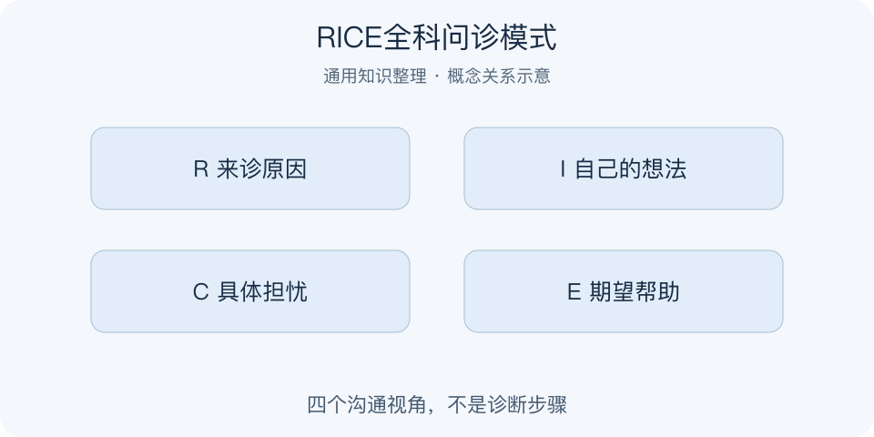

# RICE全科问诊模式｜一分钟看懂

> 基于通用知识整理，尚未与视频内容核对。
> 内容类型：通用知识版

采用《中国全科医学》中的 Reason、Idea、Concern、Expectation 版本，不套用产品优先级或运动损伤的同名缩写。

患者说“我想做个检查”，背后可能同时有症状、自己的解释、担心和希望。RICE问诊帮助把这些层次分开：为什么来诊、认为出了什么问题、最担心什么、希望得到什么帮助。它是理解就诊议题的沟通提示，不是依据四个答案自动得出诊断的算法。

- R：Reason，了解本次就诊的主要原因。
- I：Idea，听取患者对问题的想法。
- C：Concern，辨认具体担忧。
- E：Expectation，了解希望获得的帮助。

最简使用：先让对方完整讲述，再补问尚未明确的维度，用自己的话复述并请对方纠正。问诊后仍须由专业人员结合病史、查体及必要检查判断。跨到工作沟通时，可借用四个视角澄清诉求，但不能把客户称为病人。误区是机械连问四句，或为满足期望而直接答应不适当的检查、用药和承诺。

患者不同意复述时，应先让其纠正；听懂不等于赞同猜测，了解期望也不等于承诺照办。沟通质量看双方是否理解一致。

复述时也应区分事实与猜测。

---

[来源入口](README.md) · [明细](明细.md) · [案例](案例.md)
