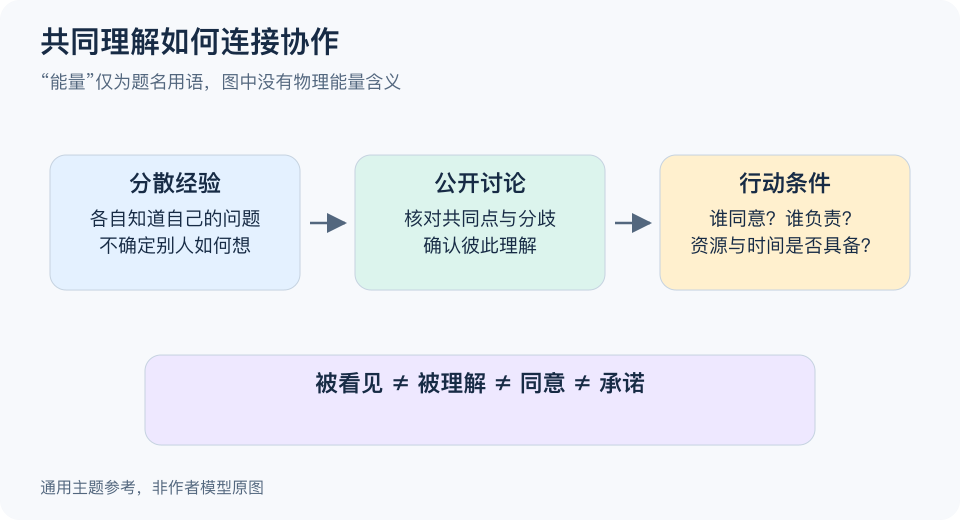

# 共鸣能量释放：一分钟看懂

> 基于通用知识整理，尚未与视频内容核对。
> 内容类型：主题参考版（原义待核实）
> 题名中的“能量”不作物理量理解；以下采用共同理解与公开协调的传播参考，不声称复现作者模型。

每个人私下都知道一件事，和每个人都知道“别人也知道”，可能带来不同的协作结果。这个参考主题关注如何把分散经验变成可讨论的公共问题，再形成明确行动，而不是把热烈反应解释成神秘能量。

- **区分听见与理解。** 信息送达，不代表受众理解相同，也不代表愿意支持。
- **让共同点具体。** 用可核实的经历或问题作为讨论入口，不凭少数人的反应推断所有人。
- **公开确认下一步。** 谁知道、谁同意、谁负责行动是三件事，需要分别确认。
- **给分歧留位置。** 共鸣不是全体一致；不同经验和反对意见也应进入讨论。

最简步骤：先向相关人了解问题，用准确语言归纳，在合适范围内公开讨论，再确认行动、责任与检查时间。观察有没有形成理解和协作，不只数点赞或掌声。

常见误区是把“让人激动”当作“让知识产生价值”，或者用夸张叙事替代事实。情绪反应可以是传播线索，却不能证明观点正确或行动有效。图展示的是信息关系，不是能量守恒、心理操控或必然爆发的规律。

[模型主页](README.md) · [明细](明细.md) · [案例](案例.md)
