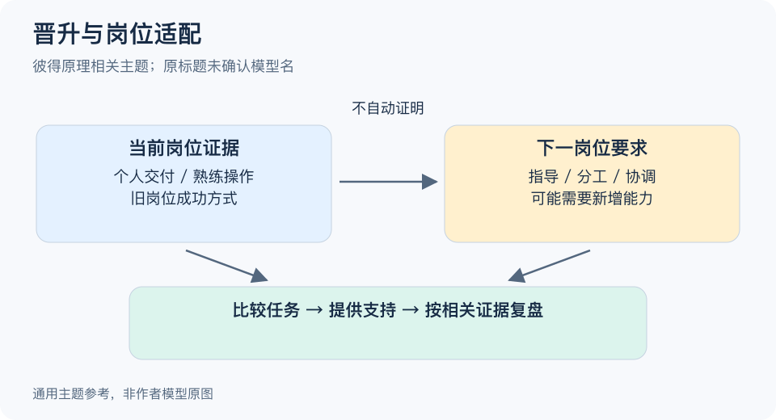

# 待核实主题-BV1Nm421N7bp：一分钟看懂

> 基于通用知识整理，尚未与视频内容核对。
> 内容类型：主题参考版（原义待核实）
> 原标题“每个管理者都不称职？”未明确命名；本稿以彼得原理与岗位适配为相关主题，不认定视频内容。

最会完成当前工作的人，不一定已经具备下一岗位需要的能力。彼得原理的相关讨论提醒组织：晋升依据如果只看旧岗位成绩，就可能忽略新职责的要求。但这不表示每个管理者都不称职，也不能用一个标签否定某个人。

- **分开两份工作。** 优秀销售与优秀销售经理的任务有交集，也有指导、分工和协调等不同要求。
- **看岗位证据。** 过去业绩是信息之一；新角色的工作样本、协作表现和学习支持也需要考察。
- **不要只给头衔。** 权限、资源、目标和辅导不到位，也可能造成表现问题。
- **允许不同发展路径。** 专业成长与管理成长可以分别设计，不必把带人当成唯一认可。

最简步骤：把当前岗位和下一岗位的关键任务并排写出，标出能力变化，再为新增要求选择一个相关且公平的观察方式。任用后约定支持和复盘，不把一次决定当作永不修正的判断。

常见误区是见到绩效下降就说“他被提拔到了无能的位置”。先检查标准、资源、环境和适应期；群体研究也不负责诊断某个具体管理者。

[模型主页](README.md) · [明细](明细.md) · [案例](案例.md)
