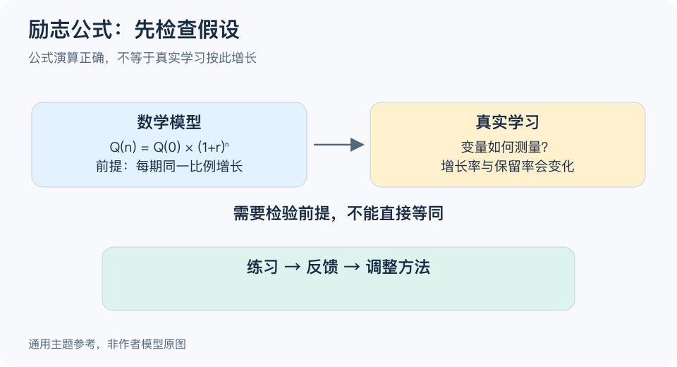

# 待核实主题-BV1Pm411d7JL：一分钟看懂

> 基于通用知识整理，尚未与视频内容核对。
> 内容类型：主题参考版（原义待核实）
> 原标题为“励志公式，看着就烦？烦就对了，哈哈哈。”；本稿讨论增长公式与学习的关系，不认定视频使用了下述公式。

“每天进步一点，一年就会变得很强”可以鼓励行动，却不能仅靠一个指数算式证明。这里的参考主题是检查数学表达背后的假设：公式算得对，并不表示它描述了真实学习。

- **先问量是什么。** 分数、速度、知识量和熟练度不是同一种东西，“能力提高百分之一”需要可定义的单位。
- **区分加法与乘法。** 每天多记几个词是增加数量；每天按已有总量的一定比例增长，是另一种假设。
- **检查增长率能否维持。** 学习可能遇到遗忘、平台期和能力上限，不会因为写了指数就持续按同一比例增长。
- **把鼓励转成实验。** 用具体练习与反馈检查是否掌握，而不是每天给自己虚构一个增长率。

最简步骤：看到励志公式时，圈出变量、单位和前提，再找一个真实可观察的学习结果。若前提无法成立，就把公式当作比喻，把行动计划另写清楚。

常见误区有两个：用漂亮数字保证成功，或者因夸张公式不成立就否定持续练习。持续投入可以有价值，但价值来自适当的方法、反馈和条件，不能由一个算式替代证明。

[模型主页](README.md) · [明细](明细.md) · [案例](案例.md)
