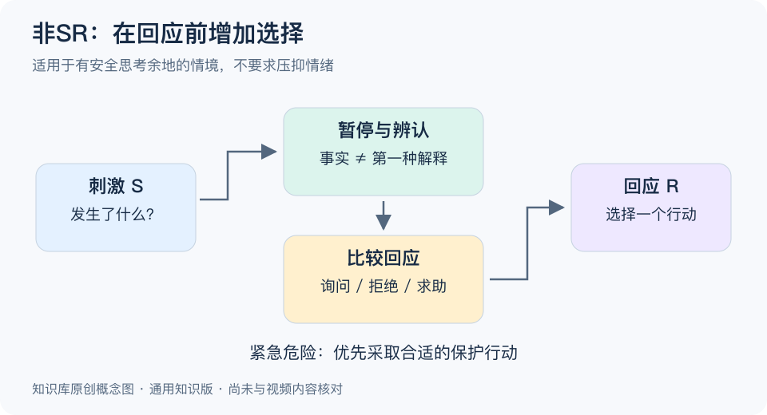

# 非SR思维模型：一分钟看懂

> 基于通用知识整理，尚未与视频内容核对。
> 内容类型：通用知识版
> 采用“刺激—思考选择—回应”的常见管理表述；它是行动提醒，不是对全部人类行为的完整科学模型。

收到一句刺耳的评价，马上回击，可能把一次信息分歧变成关系冲突。非SR思维在这里指：当情境允许时，在外部刺激S与反应R之间留出解释和选择，不把第一反应自动当成最终行动。

- **拆开事实与解释。** “对方没回消息”是观察，“对方看不起我”是待证实的解释。
- **识别行动余地。** 你可能不能决定事件是否发生，却可以比较询问、等待、拒绝或求助等回应。
- **评价后果。** 既看眼前释放情绪，也看是否解决问题、是否符合自己的边界。
- **允许有情绪。** 思考不是强迫自己毫无感受，更不是把责任全部推给被冒犯的一方。

最简步骤：暂停一个足够看清问题的片刻，写出事实和两种可能解释，选一个安全、可逆、能获得信息的回应。暂停多久由事情紧急程度决定，不存在通用于所有人的五秒规则。

误区是把“不要条件反射”扩大为“任何时候都要慢慢想”。危险时的即时避让、熟练操作中的快速反应可能十分必要；有意识的回应也可以是明确说不。模型用于增加选择，不用于要求人忍受伤害。

[模型主页](README.md) · [明细](明细.md) · [案例](案例.md)
