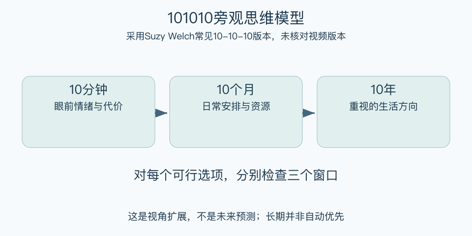

# 101010旁观思维模型：一分钟看懂

> 基于通用知识整理，尚未与视频内容核对。
> 内容类型：通用知识版

一条令人不快的消息，可能让人立即想辞职或争吵。10-10-10让同一个选择放到三个时间尺度上看：十分钟、十个月、十年后，会带来什么后果。本稿采用Suzy Welch公开说明的通用版本；“旁观”及视频的具体解释未核实。

- 短期：承认眼前情绪、便利和代价。
- 中期：想想日常安排、关系和资源如何改变。
- 长期：检查方向是否符合自己的重要价值。
- 三个尺度都服务于比较选项，不是预测未来必然发生什么。

最简用法：列出至少两个可行选择，对每个选择分别写三个尺度的收益、代价与未知。将确定事实和想象分开，再选一个符合价值、能承担后果的下一步；可以先咨询、试做或暂缓不可逆承诺。

误区是认为十年后的事永远更重要，或者把遥远的美好故事当成证据。十是便于记忆的观察窗口，不是科学精确的时间常数；遇到必须立即处理的现实问题，仍需先完成必要行动。

[模型主页](README.md) · [明细](明细.md) · [案例](案例.md)
