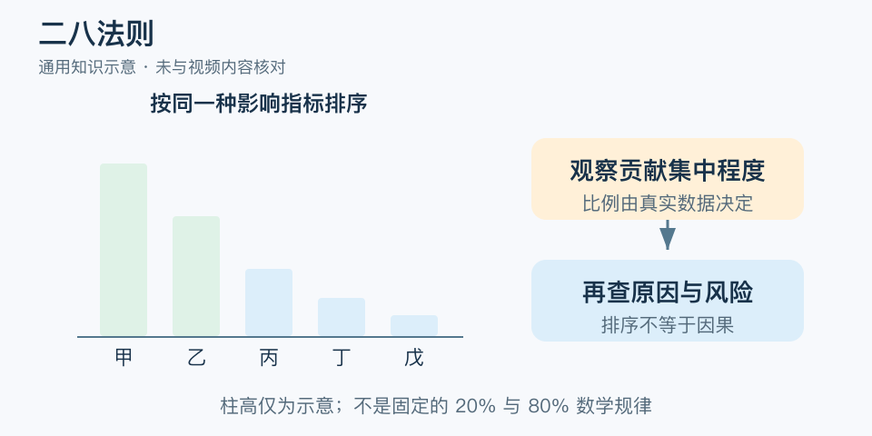

# 二八法则：一分钟看懂

> 基于通用知识整理，尚未与视频内容核对。
> 内容类型：通用知识版

一百条投诉中，某几类问题可能占了大部分处理时间。二八法则提醒我们关注贡献不均：少数项目有时贡献较大部分结果。这里采用帕累托原则的通用管理用法，“二八”是提示观察集中程度的经验说法，不是固定比例的自然定律。

- 先说清结果是收入、耗时、频次还是损失，不混用指标。
- 用真实数据排序，再看累计占比，不能预先圈定那“百分之二十”。
- 高频不等于高风险，低频严重问题要另行处理。
- 排名会变化，改进后需要重新观察。

最简应用是记录一段时间内各类问题及其影响，从大到小排，找出最值得进一步分析的一两类，再追查原因并试验改进。集中资源可以提高针对性，但排序本身不证明因果。

常见误区是据此断言“只做两成工作就够了”，或把其余客户、知识和安全检查全部删掉。低频项目可能支撑关键环节，也可能承担必须履行的责任。二八法则帮助选择先后顺序，不免除完整交付的要求。

文字定义与适用边界参见[明细](明细.md)。

[模型主页](README.md) · [明细](明细.md) · [案例](案例.md)
