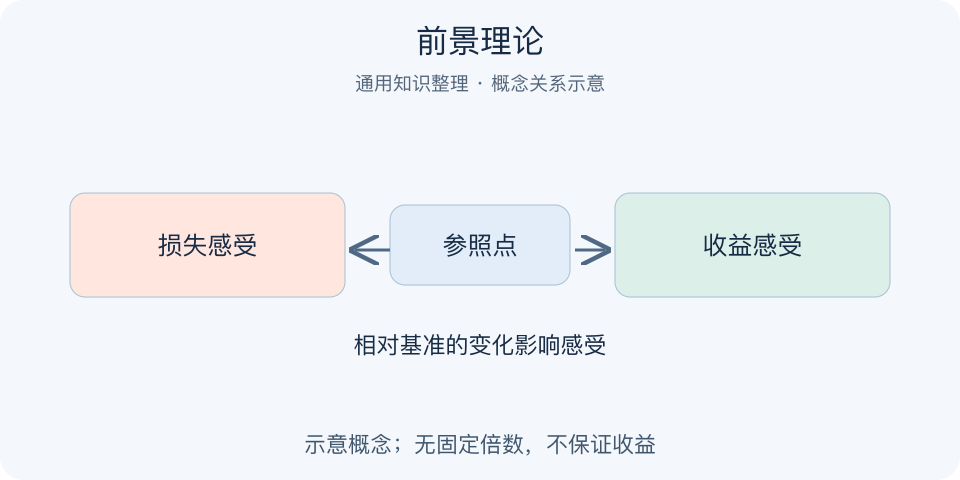

# 前景理论｜一分钟看懂

> 基于通用知识整理，尚未与视频内容核对。
> 内容类型：通用知识版

采用卡尼曼与特沃斯基关于风险决策的前景理论通用说明；仅解释认知，不作为投资策略。

同样面对一项不确定结果，人可能在“已经获利”和“正在亏损”的感觉下作出不同选择。前景理论用参照点、对得失的不同感受以及概率权重解释部分风险选择。它描述人可能怎样判断，不规定人应当怎样下注，更不能从一句题目精确预测每个人的答案。

- 人常相对某个参照点评价收益与损失。
- 同等幅度的损失可能比收益更敏感。
- 金额增加带来的感受变化并非线性。
- 主观概率权重不总等于客观概率。

最简自查：写出实际结果、概率与最坏后果，再写自己拿什么作基准；换一个合理基准，看偏好是否改变。决定仍需考虑承受能力、目标和可选方案。误区是宣称损失痛苦永远恰好为收益的两倍，或把期望值为正视作可以承担全部损失的理由。理论中的倾向有条件，不能充当收益保证。

还应区分风险概率与主观感受：感到很可能或很可怕，并不能证明发生概率；反过来，概率小也不能抹去严重后果。

---

[来源入口](README.md) · [明细](明细.md) · [案例](案例.md)
