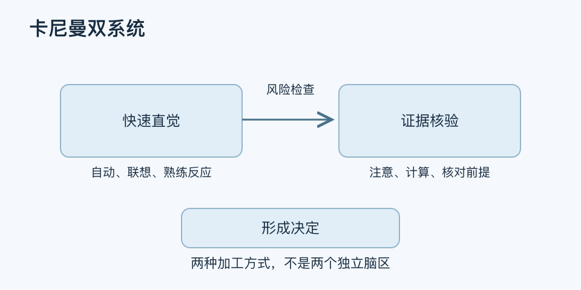

# 卡尼曼双系统｜一分钟看懂

> 基于通用知识整理，尚未与视频内容核对。
> 内容类型：通用知识版

[返回主题](README.md) · [明细](明细.md) · [案例](案例.md)

面对一道熟悉题，你可能脱口而出；面对多步计算，你需要停下来。这是双系统框架描述的两类加工方式：系统一偏快速、自动、联想，系统二偏费力、注意控制与逐步检验。本稿采用卡尼曼的通俗双过程版本，不把两者当作两个独立脑区或两类人格。

- 快不等于错：熟练技能常依赖自动化判断。
- 慢不等于对：认真思考也可能替最初偏见找理由。
- 熟悉感、顺口程度和自信，都不等于证据质量。
- 风险大、信息陌生或容易受情绪影响时，值得增加校验环节。

最简用法：先写直觉结论，再问“依据是什么、缺了什么、有没有反例”，用数据或第二种方法核对，最后设定停止分析的条件。例如重要采购先统一比较口径，再看促销话术。

它解决的是何时检查直觉，而不是要求所有事情都慢慢做。把自己称为“系统二的人”，或者把不同意见归咎于对方“不理性”，都会使框架失去用途。
