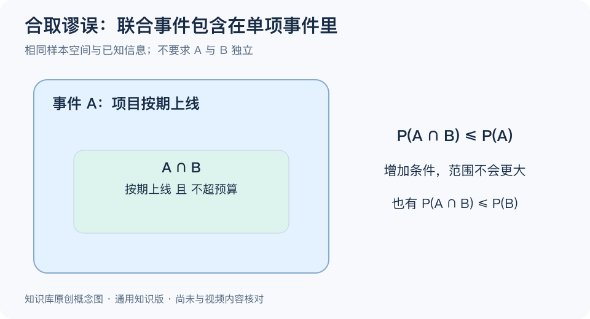

# 合取谬误：一分钟看懂

> 基于通用知识整理，尚未与视频内容核对。文字来源见[明细](明细.md)。
> 内容类型：通用知识版

“明天会下雨”和“明天会下雨，而且你会迟到”，后一句更有画面，却不可能比前一句更容易发生。把“同时满足多个条件”判断得比其中一个条件更可能，就是合取谬误。它提醒我们：故事是否像真的，与事件发生的概率，是两个问题。

记住四点：

- **范围越窄，概率不增。** 同时发生 A 和 B 的情况，都包含在 A 的情况里。
- **细节增加可信感，不自动增加概率。** 合理的因果故事仍需满足概率约束。
- **不要求事件独立。** 即使下雨会增加迟到风险，“下雨且迟到”也不比“下雨”更可能。
- **先统一条件。** 时间、对象、已知信息不同的两个判断，不能直接套用这个比较。

使用时，先把长描述拆成 A、B，再确认比较的是 A 与“A 且 B”，最后画包含关系或设想一百次情形。不会算具体概率，也能判断这种大小关系。

常见误区是将规则说成“细节越多越假”。具体事件完全可能是真的；这里约束的是同一信息条件下的概率大小，也不表示越简单的解释就一定正确。

[模型主页](README.md) · [明细](明细.md) · [案例](案例.md)
