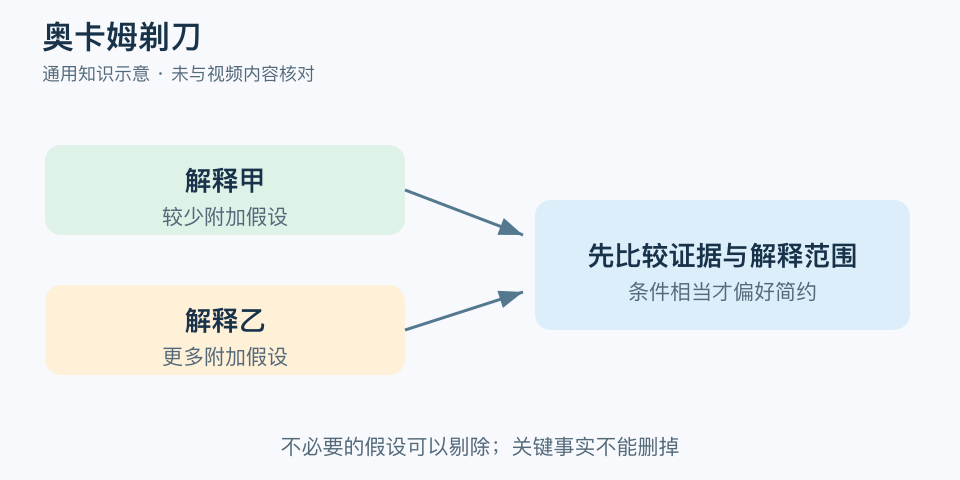

# 奥卡姆剃刀：一分钟看懂

> 基于通用知识整理，尚未与视频内容核对。
> 内容类型：通用知识版

电脑连不上网，可以先检查连接设置，也可以想象一套复杂的阴谋。奥卡姆剃刀提醒：在证据支持与解释能力等条件相当时，优先考虑不额外增加无必要假设的解释。它是一种节省假设的原则，不是“最简单的说法一定真”。

- 先要求解释符合事实，再比较复杂程度。
- 简单不是字数少，而是少引入没有贡献的假设或实体。
- 更复杂的解释若有额外证据支持，应认真考虑。
- 暂时采用一个解释，仍要保留被新证据推翻的可能。

最简应用是列出两个候选解释，各写它们能解释的事实、需要额外假定什么、下一步如何区分。先做成本低且有区分力的检查，证据不符就改判断。

常见误区是为了简单删掉关键条件，或把熟悉误当简单。实际故障可能同时有多个原因，现实也不负责满足人的审美。剃刀剔除的是不必要的负担，不是麻烦的反证；它不能单独给解释计算真实概率，更不能免除验证。

文字定义与适用边界参见[明细](明细.md)。

[模型主页](README.md) · [明细](明细.md) · [案例](案例.md)
