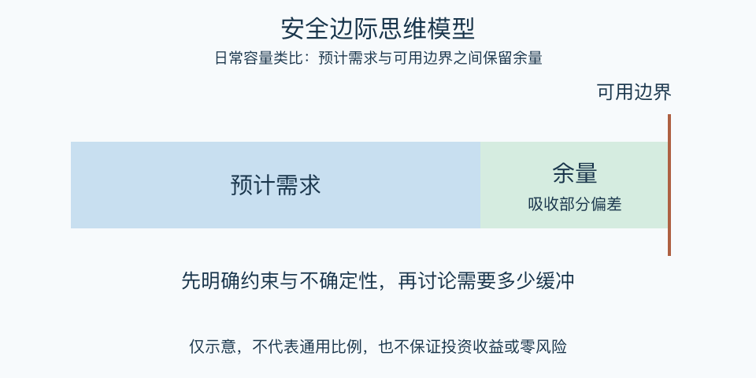

# 安全边际思维模型：一分钟看懂

> 基于通用知识整理，尚未与视频内容核对。
> 内容类型：通用知识版

预计一项工作需要八天，却承诺第八天一早交付，任何小偏差都可能导致违约。安全边际是在估计和不可承受的边界之间留出余量，让一定范围的错误仍可被承受。本稿先采用价值投资中的常见含义，再明确类比到时间和容量管理。

- 投资语境中，关注买价相对保守估值的空间。
- 日常决策中，先写清不能突破的约束。
- 余量应对应不确定性，不能随意加一个固定比例。
- 缓冲也有成本，需要随证据变化复查。

最简用法：列出预计需求、可能不利变化和可用资源；用不利情景检查是否仍能守住底线。若关键数值无法可靠估计，应先补证据、缩小承诺或放弃，而不是用巨大缓冲掩盖不了解。

误区是把便宜等同于安全，或把留了余量当作不会失败的保证。估值可能错误、风险可能超出设想；安全边际只能吸收部分偏差，不能取消研究、限制损失和持续监测。

[模型主页](README.md) · [明细](明细.md) · [案例](案例.md)
