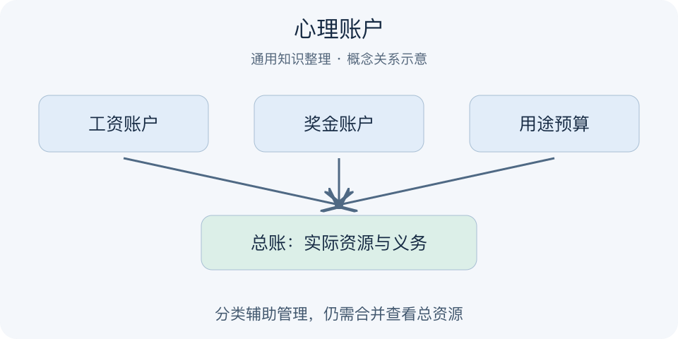

# 心理账户｜一分钟看懂

> 基于通用知识整理，尚未与视频内容核对。
> 内容类型：通用知识版

采用理查德·塞勒的行为经济学概念；本文为认知与预算整理，不提供个性化投资建议。

工资里的三百元舍不得花，奖金里的三百元却觉得“白来的”。心理账户指人们在心里按来源、用途或事件给钱分类，并分别评价得失。分类能帮助控制开支，也可能让相同金额被区别对待，从而忽略总体资源。问题不是记账本身，而是账户标签是否遮住了整体后果。

- 收入来源标签会影响花钱的感觉。
- 用途预算可以帮助执行长期计划。
- 单个账户划算，不代表总体划算。
- 同时查看分账户与总账，保留两种视角。

最简应用：遇到“这笔不算花钱”的说法，把实际支出写入统一总账，再检查是否符合原定用途和优先级。预算可以分桶，但例外规则要提前约定。误区是认为心理账户全是坏事，或反过来用每个分类都有余额证明任何支出都合理。付款方式、退款和优惠都不会凭空增加真实资源。

遇到退款时尤其容易混淆：退回原先支出的一部分，与获得全新的额外资源并非同一回事，是否再花应重新按用途和总额判断。

---

[来源入口](README.md) · [明细](明细.md) · [案例](案例.md)
