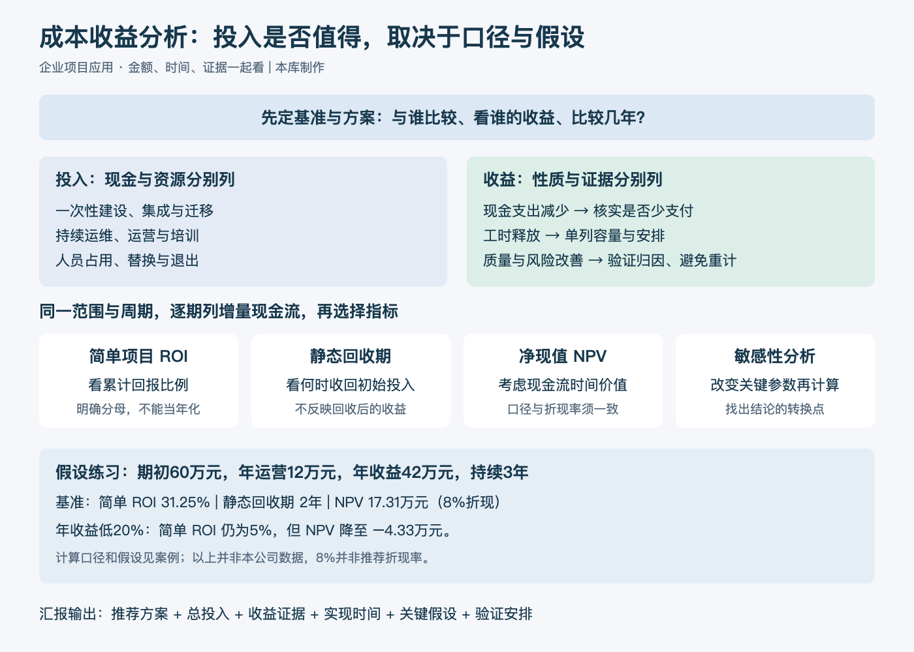

# 成本收益分析：一分钟看懂

> 内容类型：通用知识版。按工作需要新增，未关联来源视频；文字依据与公式口径见[明细](明细.md)。

成本收益分析把可选方案放在相同范围与时间下比较，判断新增投入是否带来足够收益。向上级汇报时，除了“需要多少钱”，还要说明收益来自哪里、多久实现、哪些条件会改变结论。

- **先定比较基准。** 与维持现状、最低必要改进或其他可行方案相比，究竟新增了什么成本和收益？
- **算全投入。** 除建设费用，还要考虑集成、迁移、培训、持续运营和退出费用；人力占用单列说明。
- **区分收益性质。** 可减少的现金支出、释放工时、质量改善和风险降低分别展示。工时释放未转化为支出减少时，不能计成现金节省。
- **同时看金额、时间和不确定性。** ROI 看给定口径的回报比例，回收期看资金收回时间，净现值考虑时间价值，敏感性分析检查关键假设。

最简步骤：选定方案与基准 → 列成本收益及证据 → 按时间计算 → 改变关键假设 → 提出有条件的建议。

常见误区是把年度收益除以一次性建设费，就称为项目 ROI。周期、分母和持续费用不一致时，这个比例容易误导；必要的安全与质量要求也不能仅凭 ROI 高低决定是否执行。

[模型主页](README.md) · [明细](明细.md) · [案例](案例.md)
