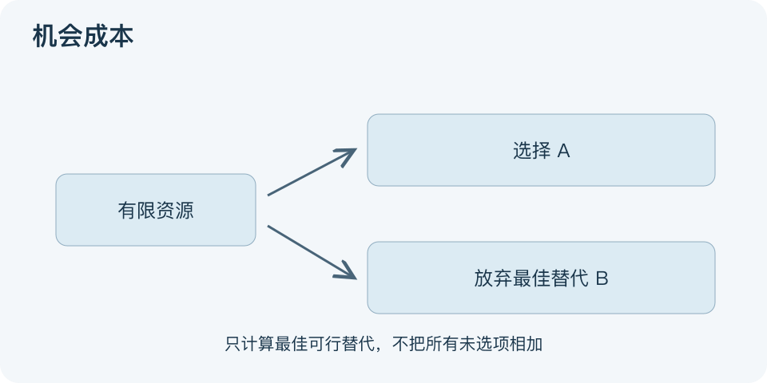

# 机会成本：一分钟看懂

> 基于通用知识整理，尚未与视频内容核对。
> 内容类型：通用知识版

周六下午只能用于休息或备考，选择备考的代价不只是一杯咖啡钱，还包括放弃的休息价值。机会成本是做出选择时，所放弃的最佳可行替代方案的价值；不是所有没选项价值相加。

- 先确认资源稀缺：时间、资金、场地或注意力为何不能兼用。
- 替代方案要真实可行，不能拿事后才知道的完美结果比较。
- 成本不限金钱，休息、陪伴、学习机会也可以有价值。
- 只看决策之后会改变的得失；无法收回的沉没投入不决定下一步。

最简应用：写出当前选择及最好的另一个可行选项，用同一时间范围比较各自的增量收益、支出与风险。图中选A就放弃B，表达的是排他选择；若两者能兼得，应重新定义资源约束。

难以量化的价值可以定性比较，不必硬换成收入。误区是把“本来可能赚到的最高金额”都叫损失，或者用别人的时薪否定自己的休息。机会成本帮助解释你为了什么放弃什么，并不要求每一分钟都变现。

文字依据和适用边界见[明细](明细.md)。

[模型主页](README.md) · [明细](明细.md) · [案例](案例.md)
