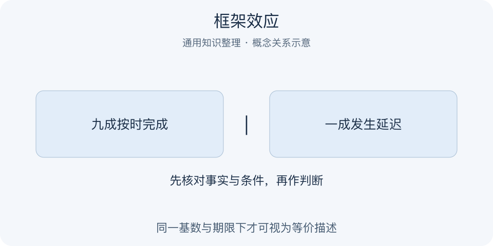

# 框架效应｜一分钟看懂

> 基于通用知识整理，尚未与视频内容核对。
> 内容类型：通用知识版

采用特沃斯基与卡尼曼关于等价描述影响选择的通用概念。

同一项服务，“九成订单按时完成”和“一成订单延迟”可能让人产生不同印象。框架效应指事实或后果实质相当时，呈现方式仍可能影响判断与偏好。它帮助我们检查自己是在回应实际差异，还是在回应措辞；但两段话并非仅因数字互补就必然等价。

- 先核对基数、时间和后果是否相同。
- 收益与损失表达可能改变注意重点。
- 概率相同不等于遗漏的信息也相同。
- 用中性表格重写，再比较真实后果。

最简步骤：把方案都写成相同人数或次数下的结果，同时列出成功与失败、收益与代价，再做一次选择。若偏好改变，追问是补充了新信息，还是只有标签变化。误区是把所有沟通差异都叫操纵；有时新表述确实揭示了原先遗漏的风险。理解框架应提高透明度，而不是训练隐瞒重要事实的文案。

比较之前还可问：如果把双方措辞互换，我的判断会不会跟着换？这个自查只帮助发现注意偏移，不替代对事实等价性的核验。

---

[来源入口](README.md) · [明细](明细.md) · [案例](案例.md)
