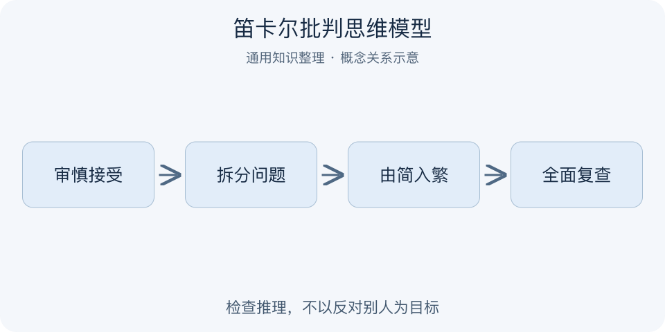

# 笛卡尔批判思维模型｜一分钟看懂

> 基于通用知识整理，尚未与视频内容核对。
> 内容类型：通用知识版

采用《方法谈》第二部分四条方法规则的通用解读：审慎接受、分解、由简入繁、全面复查。未证实视频作者选取的是这套结构。

看到一个流传很广的结论，马上附和与逢说必反同样容易跳过证据。这里借笛卡尔《方法谈》的四条规则整理判断：不仓促接受，把难题分开，从简单清楚处推进，再检查有没有遗漏。它要求管住自己的推理，而不是把反驳别人当作目标。

- 暂缓未经充分检查的结论，也包括自己的直觉。
- 把大问题拆成能分别审视的部分。
- 从较清楚的前提出发，说明推理关系。
- 复查遗漏、跳步与未说明的假设。

最简使用：写出待判断的一句话，列证据和假设，分解关键环节，检查结论是否真的由前提推出，最后标注仍不确定之处。现实经验问题通常不能达到数学式确定性，需要允许暂定判断和证据更新。误区是因为不能绝对证明就一概否定，或不断提出无关质疑却拒绝说明自己接受什么证据。

如果自己提出怀疑，也应说明哪项前提值得查、怎样查，以及何种结果会让自己接受主张；只要求别人自证不能形成公平讨论。

---

[来源入口](README.md) · [明细](明细.md) · [案例](案例.md)
