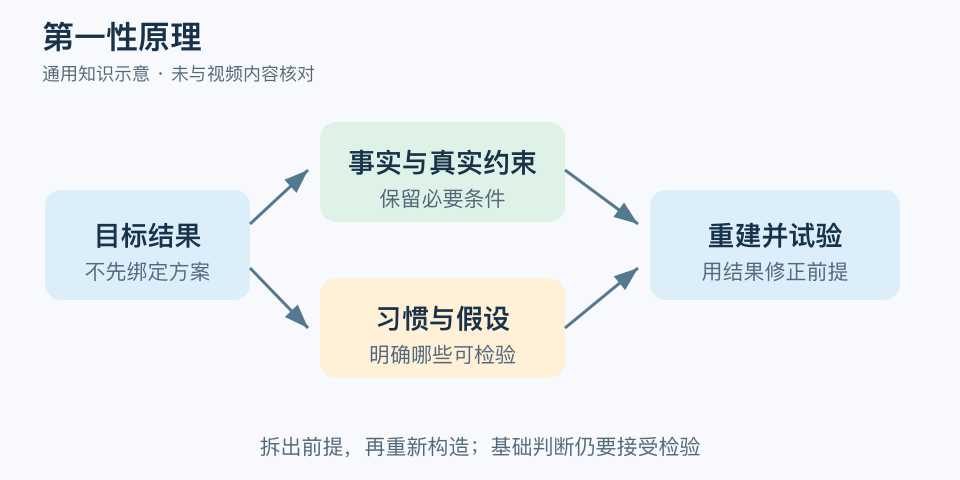

# 第一性原理：一分钟看懂

> 基于通用知识整理，尚未与视频内容核对。
> 内容类型：通用知识版

“同行都是这样做的”能提供参考，却不能证明只有这一种做法。第一性原理思考尝试把问题退回到较基础、可说明的事实与约束，再从那里重新构造方案。本稿采用现代问题解决语境的通用版本，不把它等同于完整的亚里士多德哲学。

- 先写需要实现的结果，不先绑定熟悉的产品或流程。
- 区分事实、约束和习惯；“一直如此”通常只是习惯的描述。
- 推导必须写出中间环节，不能用“本质上”跳过证据。
- 重新组合后仍要试验，基础判断也可能不完整或有误。

最简应用：把一句“必须这样做”拆开，问它依据的是物理限制、资源条件、规则要求，还是未经检验的假设；保留真实约束，为可改变部分提出一个低成本替代，再比较结果。

常见误区是相信自己想得够深就不需要经验。成熟做法常包含不易看见的失败教训，拆解时要把这些理由找出来。第一性原理不是反对类比，也不是从一句自认为绝对正确的话推导所有答案；它最有价值的部分，是暴露那些原本没被讨论的前提。

文字定义与适用边界参见[明细](明细.md)。

[模型主页](README.md) · [明细](明细.md) · [案例](案例.md)
