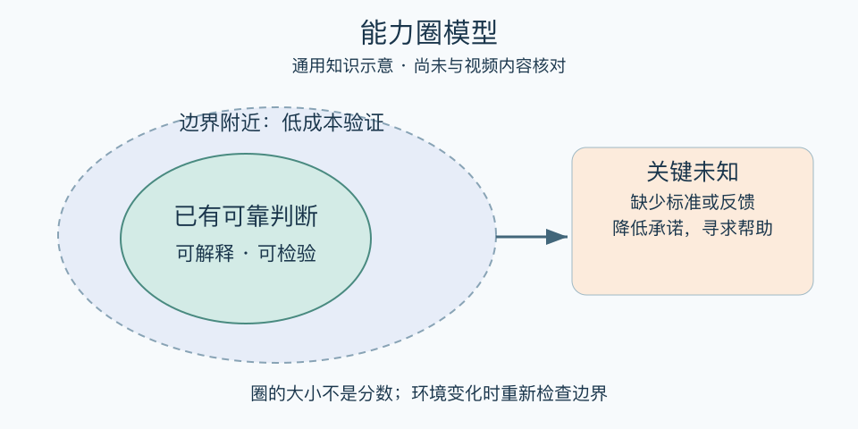

# 能力圈模型：一分钟看懂

> 基于通用知识整理，尚未与视频内容核对。
> 内容类型：通用知识版

会用一种产品，不等于能判断生产它的企业；在一个岗位成功，也不等于换行业仍能准确判断。能力圈关心的是：哪些问题你能凭可靠知识和反馈作判断，边界在哪里。巴菲特在1996年股东信中强调了解边界；本稿将这一投资语境原则延伸为一般决策练习。

- 分具体任务，不给自己贴“擅长商业”这类大标签。
- 说明判断依据，区分经验、数据与猜测。
- 看反馈能否校正错误，而不是看自己多有信心。
- 圈外可学习，但高代价决定应增加验证和专业帮助。

最简用法：面对一个决定，写出“我知道什么、关键未知是什么、谁能检验”。再列一条会推翻判断的证据。先用可逆的小试验补缺口，结果稳定后才扩大承诺。

误区是以“圈外”为由永久拒绝学习，或把过去的幸运结果当作能力证明。圈内也会出错，环境变化会移动边界；知道局限只是改善判断的起点，不提供成功保证。

[模型主页](README.md) · [明细](明细.md) · [案例](案例.md)
