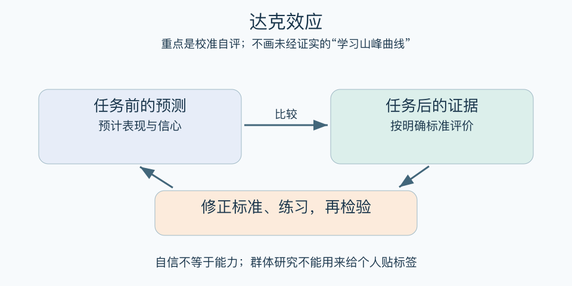

# 达克效应：一分钟看懂

> 基于通用知识整理，尚未与视频内容核对。
> 内容类型：通用知识版

刚接触一个领域时，人可能既做错，也缺少识别错误的标准。达克效应讨论能力表现与自我评价的偏差，不能简单压缩成“越无知越自信”。原始研究针对具体测试，后续研究也讨论统计机制对图形的贡献。

- 自信、实际得分、相对排名是不同量。
- 一次表现差不能说明一个人整体能力低。
- 网络上的“愚昧山峰—绝望谷底”曲线不是人人必经的学习轨迹。
- 最有用的做法是校准自己，不是给争论对手贴标签。

最简用法：做任务前写下预测和信心，完成后按清晰标准评分，再比较差距。把“我觉得懂了”换成“我能独立解释并完成新题吗”。请有相关经验的人指出错误，下一次再检查同类错误是否减少。

误区是认为谦虚就证明能力高，或认为发现统计解释便说明人从不高估自己。这个话题存在解释争议；实际应用宜落在可检验的反馈与学习，而不是借一条流行曲线断定人格。

[模型主页](README.md) · [明细](明细.md) · [案例](案例.md)
