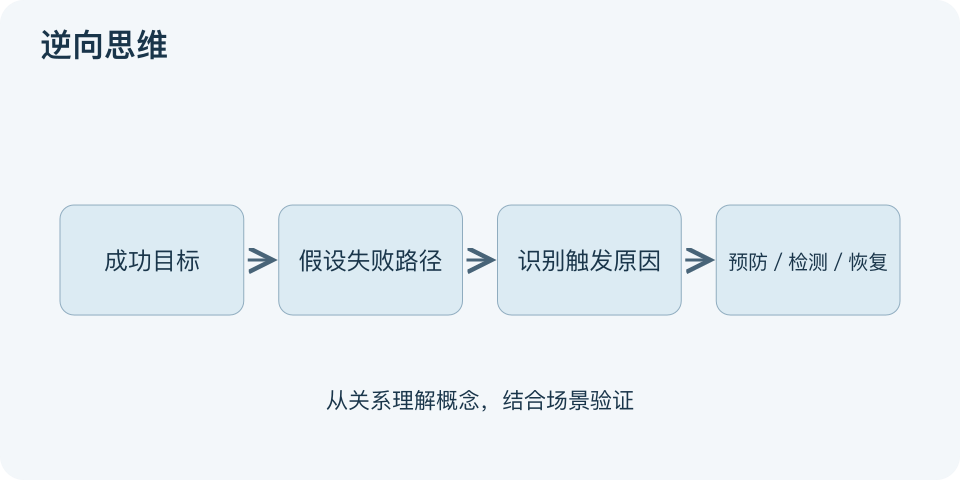

# 逆向思维：一分钟看懂

> 基于通用知识整理，尚未与视频内容核对。
> 内容类型：通用知识版

与其只问“怎样成功”，也可以问“怎样会失败”，再把可避免原因转回行动。逆向思维是一类改变问题方向的启发式方法，本文采用目标反转与失败预演的通用版本，不主张逢人必反或反着做就对。

- 先保留真实目标，再反转一个关键问题。
- 列出具体失败方式，如遗漏确认，而非抽象“做不好”。
- 追问触发条件，区分可控原因和外部风险。
- 把原因转成预防、检测或恢复措施，并重新验证。

最简应用：写下一个计划，假设它已失败，列三种可信原因；挑最重要且能处理的一项安排检查。图从成功目标转向失败路径，再返回预防措施，强调反向提问最终仍要服务正向目标。

它适合计划前找漏洞，也可用于创意联想。误区是把原因逐字取反就认定有效：消除迟到不等于会议必有价值，避免差评不等于产品有需求。逆向分析补充正向设计，仍需证据、资源和可接受性检查；不能为了制造新意而违反事实。

文字依据和适用边界见[明细](明细.md)。

[模型主页](README.md) · [明细](明细.md) · [案例](案例.md)
