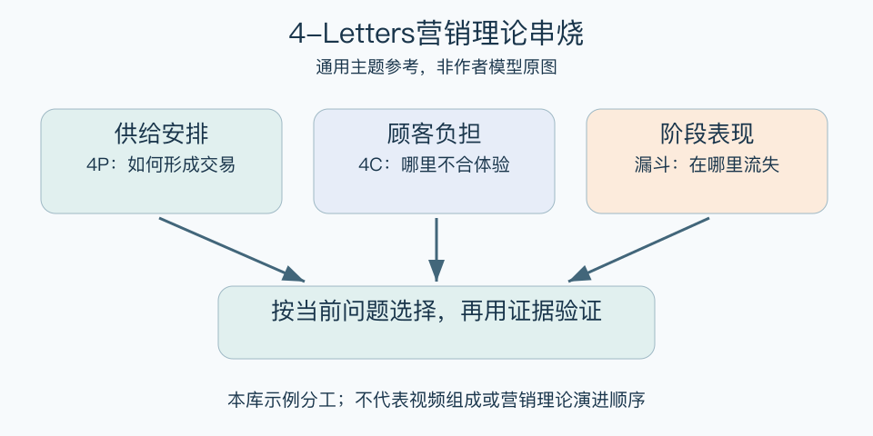

# 4-Letters营销理论串烧：一分钟看懂

> 基于通用知识整理，尚未与视频内容核对。
> 内容类型：主题参考版（原义待核实）

> 题名定义待核实；以下为相关主题参考，不代表该模型或作者观点。本稿参考主题：按问题选择营销框架，不推测视频组成或理论历史。

遇到营销问题时，背出越多缩写不一定越有帮助。本页不猜测“串烧”包含哪些模型，而用营销框架分工作同主题参考：先明确要回答什么，再选择能帮助组织证据的框架，最后落实可验证动作。

- 顾客与定位问题：先明确服务对象和购买场景。
- 供给安排问题：4P检查产品、价格、渠道与推广。
- 交易障碍问题：4C从需求和付出反查体验。
- 过程表现问题：漏斗观察同一批客户在哪里流失。

最简用法：把问题改写成一句具体疑问，例如“目标用户为何试用后没有继续”。先查实际行为，再用合适框架分类，不急着开出完整营销方案。不同工具的结果可以连接，但不能因为缩写相似就认定它们属于同一理论谱系。

误区是把每个新缩写当成旧模型被淘汰的证明，或用一张概念总表替代客户证据。本稿的组合顺序为本库教学整理，既不是视频内容目录，也不是经过核实的营销理论发展史。

[模型主页](README.md) · [明细](明细.md) · [案例](案例.md)
