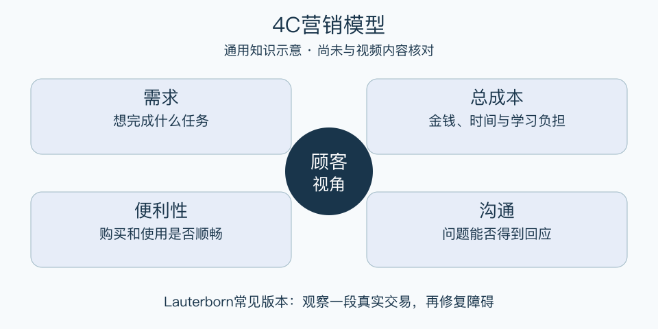

# 4C营销模型：一分钟看懂

> 基于通用知识整理，尚未与视频内容核对。
> 内容类型：通用知识版

同样一门课程，老师觉得内容丰富，学员却觉得报名麻烦、时间不合。4C用顾客视角重看交易：需求、总成本、便利性和沟通。本稿采用Lauterborn常见版本；4C另有同名版本，不能据标题认定与视频相同。

- 需求：顾客想完成什么，而不只是想要哪个功能。
- 总成本：除了标价，还有时间、学习和转换负担。
- 便利性：发现、购买、使用和求助是否容易。
- 沟通：是否能提出疑问，并得到准确回应。

最简用法：找一个具体顾客场景，观察一次完整购买或使用过程。把顾客卡住的位置分别放进四项，选最重要的障碍改一次，再请另一位目标用户实际尝试。访谈中先问过去发生的事，少问“你会不会喜欢”这样的假设问题。

误区是顾客提出什么就做什么，或把总成本理解为企业生产成本。4C有助于发现负担，但企业仍要核算交付能力与收益，也要区分真实需求、个别偏好和不适合服务的要求。

[模型主页](README.md) · [明细](明细.md) · [案例](案例.md)
