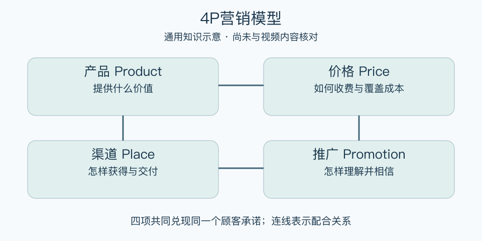

# 4P营销模型：一分钟看懂

> 基于通用知识整理，尚未与视频内容核对。
> 内容类型：通用知识版

一家咖啡店卖不动，问题可能是口味、价格、位置，也可能是顾客根本不知道它。4P把企业能调整的营销决策拆为产品、价格、渠道、推广，帮助查出整套交易安排哪里不匹配。本稿采用营销组合的常见版本，不能认定与视频采用的版本相同。

- 产品：顾客具体买到什么，包括服务和兑现的承诺。
- 价格：付款规则要同时考虑顾客接受度与经营成本。
- 渠道：顾客在哪里、通过什么方式获得产品。
- 推广：用什么信息让合适的人理解并相信价值。

最简用法：先写清服务谁、解决什么问题，再为四项各写一个现状和一条证据。找出最影响成交的一项，做一个小范围调整，同时检查另外三项是否仍然配合。例如承诺便利，却只在顾客上班时营业，宣传再多也难兑现。

误区是把推广等同于打折，或把四个栏目填满就当作完成战略。4P是决策检查表，不会自动证明市场存在；效果还要看真实购买、履约和复购。

[模型主页](README.md) · [明细](明细.md) · [案例](案例.md)
