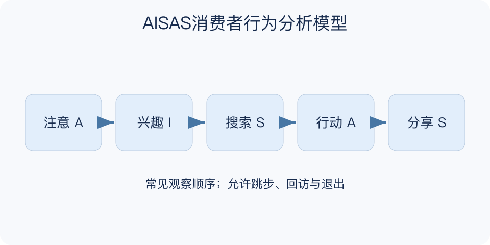

# AISAS消费者行为分析模型：一分钟看懂

> 基于通用知识整理，尚未与视频内容核对。
> 内容类型：通用知识版

**版本与边界：** 采用电通传播中的Attention、Interest、Search、Action、Share版本。它是消费者路径分析框架，不要求每个人严格按五步行动。

看到一双鞋之后，有人先搜测评再购买，有人先问朋友，还有人只把商品分享给同伴。AISAS用注意、兴趣、搜索、行动、分享五个环节观察消费者如何接触信息并采取行动，提醒营销不能只看曝光和成交。

- 注意与兴趣不同：看见广告，不代表需求已被激发。
- 搜索是主动求证：规格、口碑、价格和适用条件都可能被核查。
- 行动需明确：购买、预约或试用必须按任务分别定义。
- 分享产生后续信息：可能是推荐，也可能是投诉和提醒。
- 路径并不固定：用户可以跳步、回访或在搜索中停止。

选一类用户的一次真实任务，记录每一步需要什么信息、遇到什么阻碍，再选择一个缺口改善。按用户和时间窗口定义指标，避免把不同人群拼成一条顺畅路径。

不要把AISAS当成交保证，或默认分享一定带来正面传播。只提高点击率却不解决使用问题，可能让更多人进入体验不佳的流程。

最小产物是一张标出信息疑问与退出原因的路径图。对于无法观察的环节，写“未知”比补一条想象中的箭头更有用；行动应服务用户任务，而非强迫用户走完全部阶段。

文字依据见[明细的参考资料](明细.md#文字参考)。

[模型主页](README.md) · [一分钟看懂](一分钟看懂.md) · [明细](明细.md) · [案例](案例.md)
