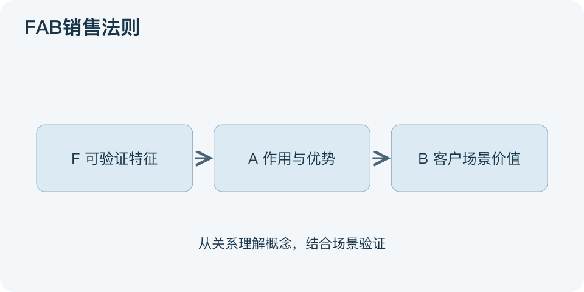

# FAB销售法则：一分钟看懂

> 基于通用知识整理，尚未与视频内容核对。
> 内容类型：通用知识版

客户问“这东西对我有什么用”，一长串配置通常没有回答问题。FAB把介绍连成三段：Feature是可核实的特征，Advantage是该特征带来的功能优势，Benefit是某位客户在具体场景得到的价值。本文采用这一常见销售沟通版本。

- 特征回答“有什么”：如支持离线编辑，不把“先进”当事实。
- 优势回答“因此能怎样”：断网时仍能继续记录，但有同步条件。
- 利益回答“对你为何重要”：经常现场走访的人可减少补录；始终联网的人未必看重它。
- 利益要经客户确认，不能由销售人员单方面替客户决定。

最简用法是先问使用场景和困扰，只挑一项相关特征，说明作用机制，再询问这种改善是否值得。把“离线编辑—断网继续工作—现场记录不中断”读成一条可检查的链，随后拿演示或规格支持它。

误区是把优势写成未经证明的竞品比较，把潜在利益说成保证收益。FAB只是组织价值说明的工具，不负责证明产品适合所有人，也不能代替价格、限制、迁移成本和真实需求调查。

文字依据和适用边界见[明细](明细.md)。

[模型主页](README.md) · [明细](明细.md) · [案例](案例.md)
