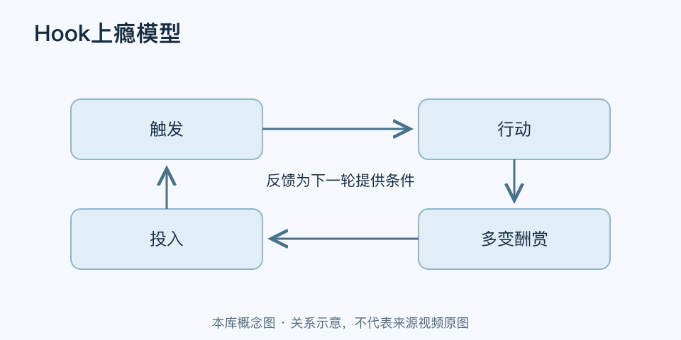

# Hook上瘾模型｜一分钟看懂

> 基于通用知识整理，尚未与视频内容核对。
> 内容类型：通用知识版

[返回主题](README.md) · [明细](明细.md) · [案例](案例.md)

为什么有些产品会让人反复回来？Nir Eyal的Hook模型用“触发—行动—多变酬赏—投入”解释习惯形成产品的一种设计循环。本稿采用作者的四阶段版本；标题里的“上瘾”是传播性译法，不等于临床成瘾诊断。

- 触发让人想起行动，可以来自环境提示，也可以是某种内在需要。
- 行动是为获得回报而做的具体行为，应足够清楚、易于开始。
- 多变酬赏包含一定不确定性，但仍须对应用户想解决的问题。
- 投入让用户留下内容、偏好或关系，为以后使用增加价值或形成下一次触发。

最简用法：选一个反复发生的真实任务，沿四环记录用户在哪里停下，再修改一处并验证。留存之外，还看任务是否完成、通知是否造成打扰、用户能否轻松退出。

不是每个产品都需要高频使用。低频服务只要需要时可靠即可；堆通知、制造焦虑、用随机奖励拖延用户，都不能证明产品创造了价值。
