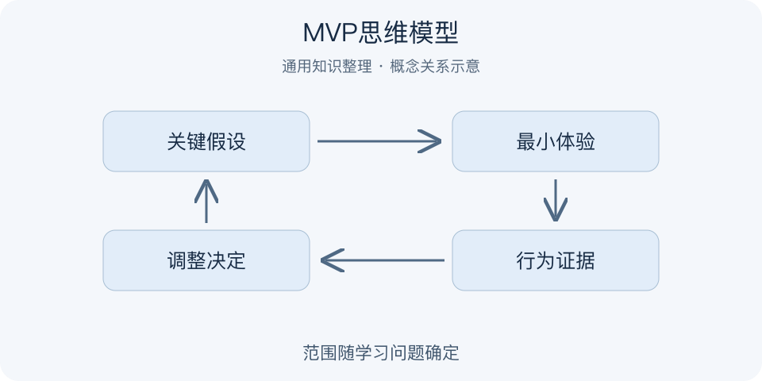

# MVP思维模型｜一分钟看懂

> 基于通用知识整理，尚未与视频内容核对。
> 内容类型：通用知识版

采用 Minimum Viable Product（最小可行产品）的通用产品管理版本，因为它有公开文字来源；视频标题强调缩写歧义，不能认定作者所指就是此版本。

准备做一个学习工具，先投入半年开发，还是先验证用户愿不愿意用它完成一次真实任务？最小可行产品用较小投入获得关于关键假设的有效学习。最小指围绕本次学习问题减少范围，可行指仍能让目标用户体验到需要验证的价值，而非把完整产品做得粗糙。

- 先写最危险的假设，再决定做什么。
- 功能数量少，不代表实验一定有效。
- 观察实际行为，区分称赞与持续使用。
- 根据证据继续、调整或停止，而非默认扩建。

最简步骤：明确一类用户和一个任务，写下什么结果支持或反对假设，设计最低成本的真实体验，记录使用过程和未解决的问题。手工服务、样机可能合适，但应准确说明能力。误区是只统计访问量，或以“只是MVP”为由忽略隐私、可靠性和必要的安全要求。一次小试验也不能直接证明市场规模。

一轮试验结束，最好能说清“我们现在更知道什么”，而不只是“已经上线什么”。无法影响下一步的指标通常还不够贴近假设。

---

[来源入口](README.md) · [明细](明细.md) · [案例](案例.md)
