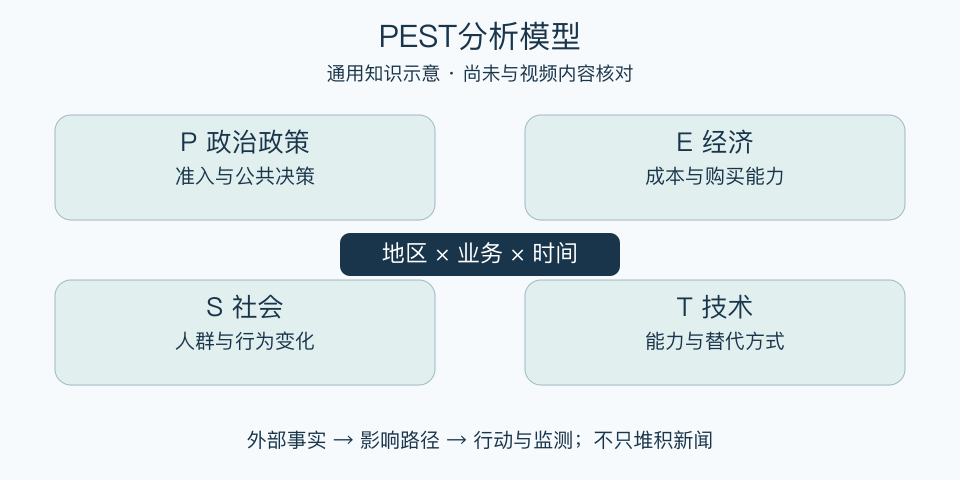

# PEST分析模型：一分钟看懂

> 基于通用知识整理，尚未与视频内容核对。
> 内容类型：通用知识版

计划开一家店，只研究附近竞争者还不够：规则变化、消费能力、人口习惯和新技术都可能改变生意。PEST用政治政策、经济、社会、技术四类线索扫描宏观外部环境，帮助识别可能影响决策的变化。

- 政治政策：哪些公共决策改变准入或经营条件？
- 经济：成本、购买力、融资条件如何变化？
- 社会：人群结构、习惯与期待有哪些变化？
- 技术：新的方式是否改变生产、交付和替代方案？

最简用法：先限定地区、业务和时间范围，每类只选几项相关变化，写出证据日期、影响路径及应对动作。把“技术发展很快”改成“某项能力可能减少哪一道成本或产生什么替代”，才有决策价值。

误区是把新闻堆成清单，或把趋势当成必然结果。PEST不负责分析内部能力，也不能直接预测销量。常见扩展PESTLE另列法律和环境；本稿采用四类版，遇到交叉因素按实际影响处理，不为分类争执。

[模型主页](README.md) · [明细](明细.md) · [案例](案例.md)
