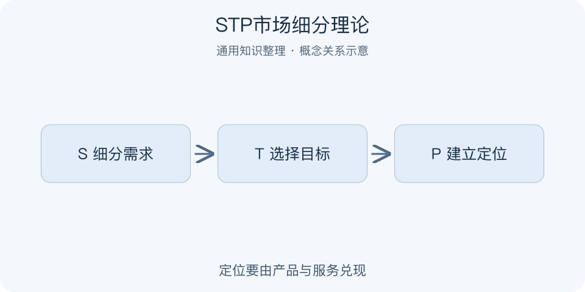

# STP市场细分理论｜一分钟看懂

> 基于通用知识整理，尚未与视频内容核对。
> 内容类型：通用知识版

采用 Segmentation、Targeting、Positioning 通用版本；视频题名中的“STPST”含义未核实，不据此扩展新步骤。

一家工具店若对所有人都说“功能很多”，往往谁也说不清为什么该买。STP依次回答：市场里有哪些需求不同的人群，优先服务哪一群，以及相对其他选择希望被如何理解。细分不是给用户贴标签，定位也不是单写一句口号；二者都要由需求证据和可交付价值支撑。

- S：按有意义的需求或反应差异细分。
- T：比较吸引力与自身能力，选目标市场。
- P：说明目标客户为什么选择你。
- 定位需要产品、渠道、价格与服务共同兑现。

最简应用：访谈并整理几类使用情境，选一个能服务且能触达的群体，用“为谁、解决什么、相对什么、凭什么”写定位，再检查产品是否支持。误区是只按年龄拼画像，或先想广告词再倒推人群。细分会随证据更新，选择目标也意味着承认暂时无法同时满足所有需求。

检查定位时可拿走品牌名：目标用户是否仍知道这项服务适合哪种任务、有什么可核对的理由？若只剩抽象赞美，定位还不够具体。

---

[来源入口](README.md) · [明细](明细.md) · [案例](案例.md)
