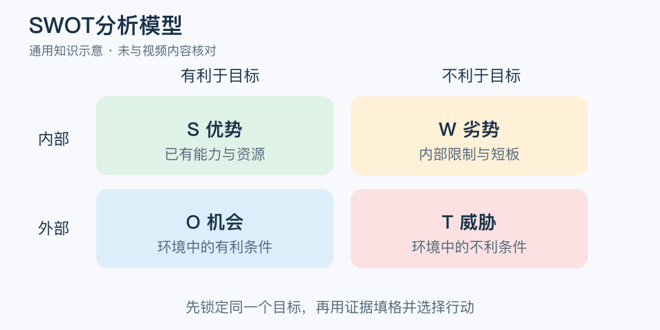

# SWOT分析模型：一分钟看懂

> 基于通用知识整理，尚未与视频内容核对。
> 内容类型：通用知识版

准备换工作时，“我沟通不错”和“行业正在招聘”都可能有利，却属于不同类型的信息。SWOT 用优势、劣势、机会、威胁四类材料，把自身条件与外部环境分开，帮助讨论一个具体目标能否实现。

- S、W 看内部：已有资源、能力、流程及短板。
- O、T 看外部：客户变化、竞争、技术或其他环境条件。
- 有利与不利必须相对于同一目标判断，同一特点在不同情境中可能变号。
- 每一项写证据和影响，不只写“品牌好”“竞争激烈”。

最简做法是先写决策，例如“本季度是否开第二个服务点”，再各列少量关键因素，从跨格组合中提出两三个行动，按成本、影响和证据强弱排序。最后给行动安排负责人和复查日期。

常见误区是填完四格就宣布有了战略。SWOT 自身不计算权重，也不自动产生最佳选项；机会不会因为写在纸上就成为自己的能力，劣势也不一定都值得优先修补。好的结果是一项可验证的选择，而不是四块密密麻麻的形容词。

文字定义与适用边界参见[明细](明细.md)。

[模型主页](README.md) · [明细](明细.md) · [案例](案例.md)
