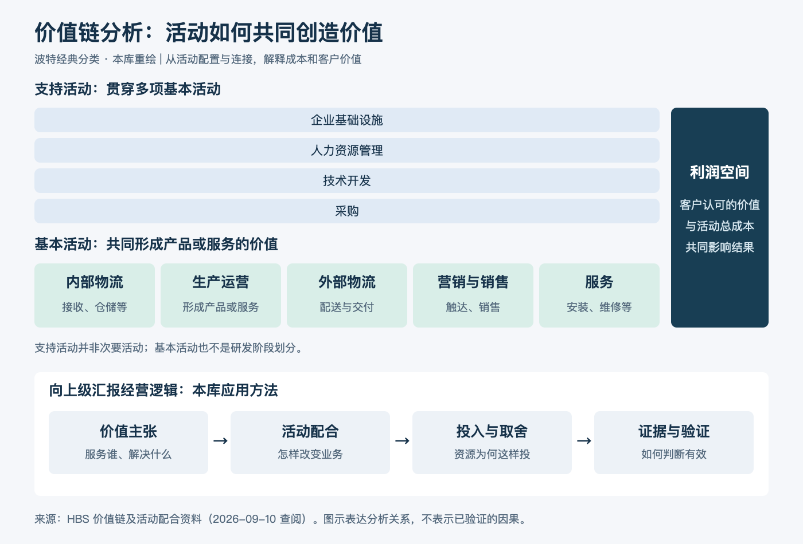

# 价值链分析：一分钟看懂

> 内容类型：通用知识版。按工作需要新增，未关联来源视频；文字依据见[明细](明细.md)。

价值链分析把业务拆成创造和交付价值的活动，检查哪些活动影响成本、客户价值，以及活动怎样配合。它帮助回答：为什么采用这种经营方式，资源优先投入哪里？

- **先定客户与范围。** 分析哪项业务、服务谁、客户重视什么，避免把整个集团混成一条链。
- **看活动与连接。** 基本活动与支持活动共同作用；研发设计的一次选择，可能改变后续制造、运输和服务成本。
- **同时看价值与代价。** 降低本部门费用，可能增加其他环节负担；客户体验改善也要有证据。
- **形成经营选择。** 说明哪些活动值得强化、哪些需要协同，以及投入的前提与取舍。

最简用法：选一个业务目标，列出关键活动，找出成本或体验问题，写出“活动改变 → 业务变化 → 经营结果”的假设，再安排验证。

向上级汇报质量平台时，可说明某项能力如何帮助业务提前识别风险、减少等待、复用经验，并用过程数据与结果数据分别验证。功能上线数量不能直接证明经营价值；也不要把五类基本活动硬套成汽车研发的五个阶段。

[模型主页](README.md) · [明细](明细.md) · [案例](案例.md)
