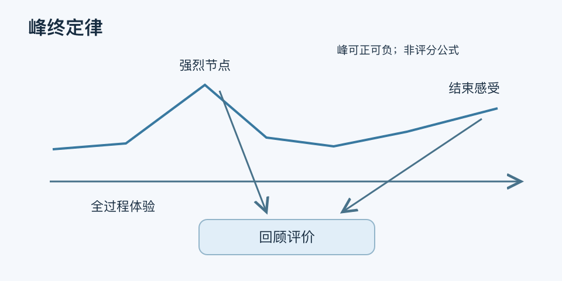

# 峰终定律｜一分钟看懂

> 基于通用知识整理，尚未与视频内容核对。
> 内容类型：通用知识版

[返回主题](README.md) · [明细](明细.md) · [案例](案例.md)

一次旅行整体不差，但最后丢行李的经历让你回想起来很糟，这提醒我们：回忆评价未必等于全过程体验的平均。峰终定律指出，在一些情境中，最强烈时刻与结束时的感受对回顾评价具有较大影响。本稿采用体验记忆研究中的含义，不把它视为所有服务的固定评分公式。

- “峰”可能是强烈快乐，也可能是强烈痛苦，不只是亮点。
- “终”是被体验者认定的结束，可能包含付款、离场或后续处理。
- 回忆满意度与当时每一步的体验要分别测量。
- 时间长短在某些研究中影响较弱，不意味着等待和持续痛苦无关紧要。

最简做法：画出一段有明确边界的体验，找最糟或最强烈节点，再检查结束环节。先消除伤害和严重故障，再考虑令人印象好的细节；改动后同时检查过程问题和回顾评价。

不要为制造高潮牺牲基本质量，也不要用一个礼物掩盖长时间糟糕服务。它可以帮助选择观察位置，不能替代完整的用户体验证据。
