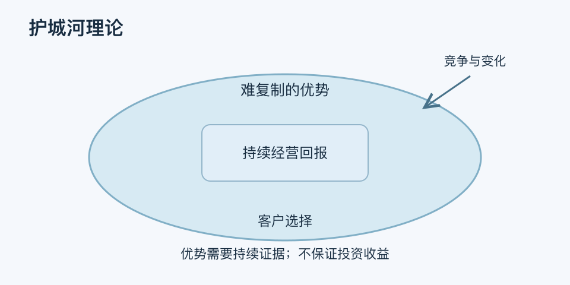

# 护城河理论｜一分钟看懂

> 基于通用知识整理，尚未与视频内容核对。
> 内容类型：通用知识版

[返回主题](README.md) · [明细](明细.md) · [案例](案例.md)

一家企业现在赚钱，不代表竞争者进入后还能持续赚钱。经济护城河用来讨论能够抵御模仿、替代与竞争侵蚀的持久优势。本稿采用商业竞争语境，参考巴菲特对长期优势的表述；它不是股价判断或保证收益的公式。

- 看优势的来源，例如成本、品牌信任、网络作用或迁移负担，而不只看利润高。
- 看竞争者能否复制，以及复制需要多少时间与资源。
- 看优势是否真正转化为客户选择和可持续的经营回报。
- 看技术、规则与客户习惯变化会怎样削弱原有优势。

最简用法：写出“客户为什么选我们—别人为何难复制—证据是什么—什么变化会使它消失”。再找一个最强替代方案进行反向检验。单一明星员工、短期补贴和先入场，都不足以单独证明护城河。

企业优势与买入价格是不同问题，即使业务优质，付出过高价格也可能带来不良结果。用于个人能力时，只能作可替代性的类比，不能把拒绝协作或囤积信息当成优势建设。
