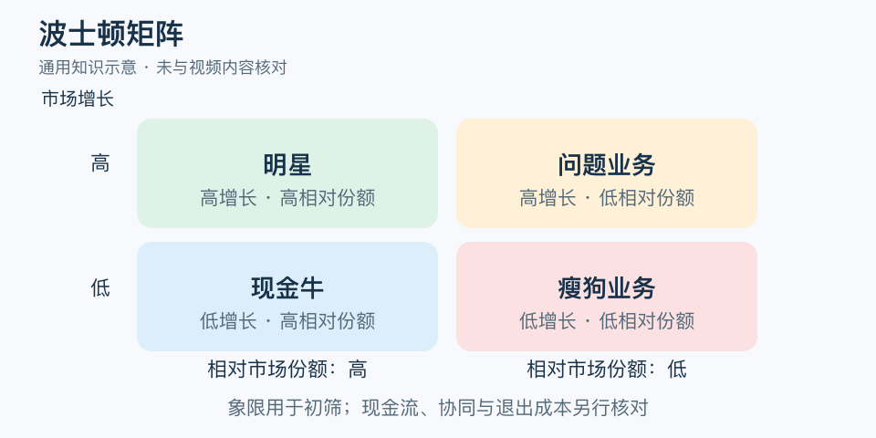

# 波士顿矩阵：一分钟看懂

> 基于通用知识整理，尚未与视频内容核对。
> 内容类型：通用知识版

一家企业有四条产品线，平均分钱看似公平，却可能让成熟业务过度投入、新业务一直长不大。波士顿矩阵用市场增长率与相对市场份额，帮助讨论业务组合中的资源分配。本稿采用 BCG 的增长—份额矩阵版本。

- 市场增长率看所在市场，不能拿自家销售增速替代。
- 相对份额比较自己与最大竞争对手；自身第一时对比第二名，不是公司内部收入占比。
- 高增长高份额称明星；低增长高份额称现金牛；高增长低份额称问题业务；双低常称瘦狗业务。
- 象限是讨论起点，实际现金流、协同和退出成本仍须单独检查。

最简应用是先划定市场与统计期间，再把各业务放入四格，选出需要补数据或小规模试验的一项，明确下次复核时间。问题业务不必全部追投，现金牛也需要维护。

常见误区是见到“瘦狗”就关闭业务。一个规模小的配套服务可能支撑核心产品销售。矩阵压缩了信息，并没有替你证明哪项业务必赚、哪项必亏，更不适合直接给人的能力和价值贴标签。

文字定义与适用边界参见[明细](明细.md)。

[模型主页](README.md) · [明细](明细.md) · [案例](案例.md)
