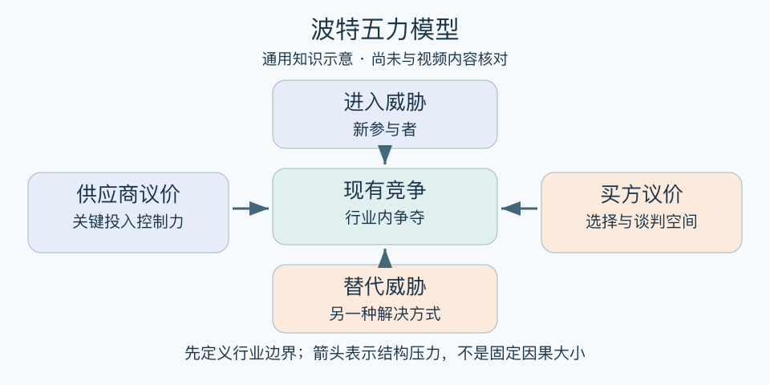

# 波特五力模型：一分钟看懂

> 基于通用知识整理，尚未与视频内容核对。
> 内容类型：通用知识版

一家店顾客不少，却始终难赚钱，原因可能不只在同行竞争：供货方强势、顾客容易转店、替代方案便宜、新店随时进入，都可能压缩利润。波特五力用五种结构力量理解行业价值如何分配。

- 现有竞争：行业内争夺如何影响价格与成本？
- 新进入者：别人进入是否容易，威胁有多大？
- 替代品：顾客能否用另一种方式完成同一任务？
- 供应商：关键投入的提供者有多少议价空间？
- 买方：顾客能否压价、转换或要求更多条件？

最简用法：先界定业务和地域，再为每种力量列证据与影响利润的路径。挑出一两种最强力量，讨论差异化、转换成本、供应安排或市场选择，并估算应对代价。

误区是把五力当作五家竞争对手，或机械打分后宣称值得投资。行业有吸引力不等于任何公司都赚钱；替代品也不必长得相似。政策和技术通常通过改变这些力量发挥作用，不能简单塞进一个万能第六力。

[模型主页](README.md) · [明细](明细.md) · [案例](案例.md)
