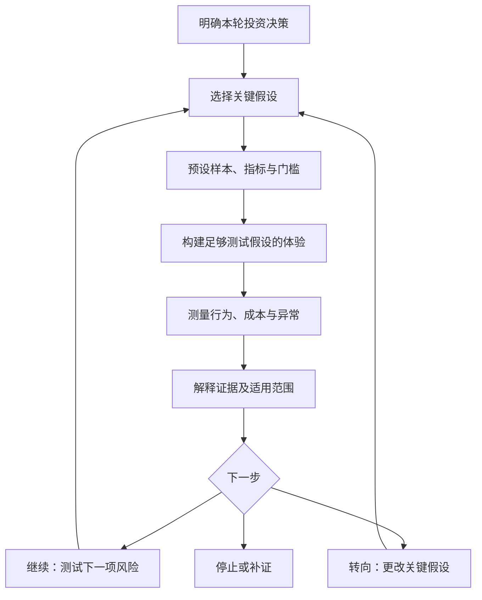

# 精益创业与验证式学习｜一分钟看懂

先说明“什么证据会改变决定”，再决定投入什么。适用于需求、购买、交付或增长条件尚不确定且可小范围验证的场景；不替代专业验收，也不能用短期小样本证明长期盈利。

示意图为本库整理，并非原作者图。

- **Build–Measure–Learn**：构建、测量、学习的反馈循环。设计实验时先倒推学习目标和所需证据。
- **MVP**：满足本轮学习目标的最小产品或体验范围。人工辅助可以存在，但须如实说明并记录成本。
- **验证式学习**：说明哪条假设获得什么支持、在哪些条件下成立、因此改变什么决定。
- **创新核算**：用与商业假设有关的指标和阶段目标检查进展，避免把文档、功能或累计注册数当作需求证明。
- **转向**：改变客户、价值、渠道等关键假设，并重新验证；普通修复或试验没执行到位不自动构成转向。

以上核心术语参考[精益创业官方说明](https://theleanstartup.com/principles)，流程细化为本库建议。

“有人喜欢”“有人付费”“交付有贡献”“能持续获客”分别回答不同问题，不能互相替代。详情见[明细](明细.md)，实际执行可用[记录模板](实验记录模板.md)。
