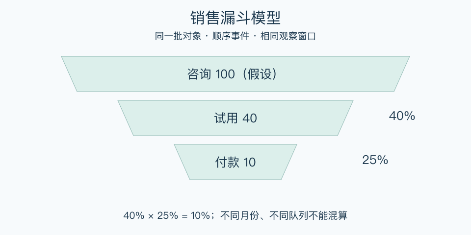

# 销售漏斗模型：一分钟看懂

> 基于通用知识整理，尚未与视频内容核对。
> 内容类型：通用知识版

一千人看到商品，只有二十人付款，直接说“销售不行”没有指出问题。销售漏斗把成交过程划成可观察阶段，比较同一批对象在哪里继续、在哪里退出。阶段应按业务定义，不存在人人通用的一套名称。

- 先统一对象：统计人、账号还是订单，不能混用。
- 每阶段有可验证事件，如咨询、试用、报价、付款。
- 转化率需要同一人群与足够观察时间。
- 看流失原因，也看等待时间和客户质量。

最简用法：选一批新客户，约定观察期限，画出三至五个必要阶段，记录人数与相邻转化率。挑出一个重要障碍，访问退出者并做小试验。阶段转化率可连乘的前提，是同一队列顺序进入且统计口径一致。

误区是把本月成交除以本月新增线索就当真实转化率，或认为所有人必然按顺序前进。老线索、跨月决策、跳步和重复购买都需单独处理；漏斗能定位现象，不能凭数字直接判定原因。

[模型主页](README.md) · [明细](明细.md) · [案例](案例.md)
