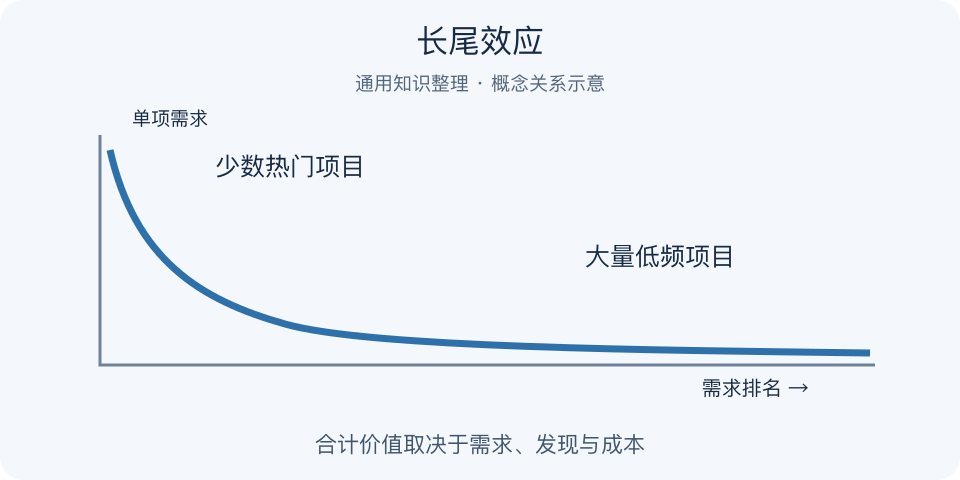

# 长尾效应｜一分钟看懂

> 基于通用知识整理，尚未与视频内容核对。
> 内容类型：通用知识版

采用克里斯·安德森讨论的商业长尾：大量低频需求在一定供给与发现条件下具有合计价值。

书店最显眼的位置只放少数畅销书，但读者还会寻找大量销量很低的专业书。长尾效应提醒：单项需求小，不等于合计需求没有价值。只有当储存、分发和发现成本足够合适时，分散需求才可能成为可服务的市场；长尾销量并不必然超过头部。

- 头部是少数高需求项目，尾部是大量低需求项目。
- 丰富供给要配合搜索、分类或推荐。
- 合计收入与合计利润必须分开算。
- 低频不等于优质，也不等于无人竞争。

最简应用：按实际需求排序，选一组有共同服务方式的小众需求，估计新增收入和维护成本，再观察是否被找到和复购。不要只数上架数量。若每个小众项目都要大量定制服务，尾部越长可能越亏。误区是把任何冷门选题都包装成长尾机会，或假定数字产品的维护、授权和获客成本为零。

看图时要分清曲线高度与尾部项目总和；这里只画关系，不代表任何行业实测数据，也没有给出必然成立的头尾比例。

---

[来源入口](README.md) · [明细](明细.md) · [案例](案例.md)
