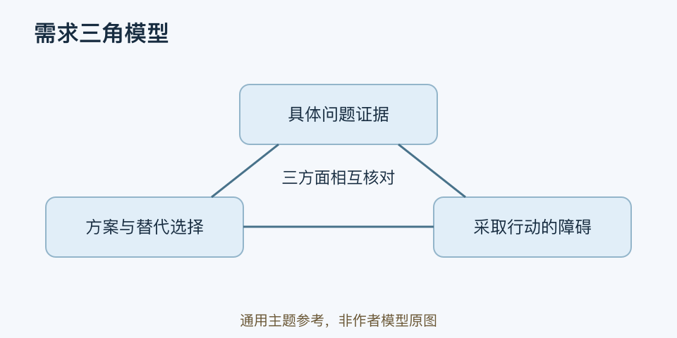

# 需求三角模型｜一分钟看懂

> 基于通用知识整理，尚未与视频内容核对。
> 内容类型：主题参考版（原义待核实）

> 题名定义待核实；以下为相关主题参考，不代表该模型或作者观点。实际参考主题：问题、方案与行动障碍的需求验证；仅找到二手原义线索。

[返回主题](README.md) · [明细](明细.md) · [案例](案例.md)

用户说“这个产品不错”，却没有采取行动，需求分析需要继续问：他究竟想解决什么、当前方案是否合适、采取行动有什么障碍。本稿只提供这三个问题构成的需求验证参考，不认定它就是李叫兽原模型的完整定义。

- 问题证据：最近一次发生在什么情境，用户目前怎样处理。
- 方案适配：你的方案改变哪一部分，用户有哪些替代选择。
- 行动可行性：金钱之外，还要看时间、学习、信任与组织权限。
- 三方面应互相核对；有痛点不必然会购买，有预算也不证明方案有用。

最简用法：选一种用户和一个具体场景，分别记录真实行为、方案反应和采用障碍，再设计小验证。先问过去怎么做，少问“如果有这个功能你会不会买”。

公开二手文字把原题名关联到“缺乏感、目标物、能力”，但本稿未取得足以确认完整原义的一手文字，所以不把这三个词扩写成作者理论。也不要为了制造需求夸大焦虑或故意增加落差；验证的对象是真实问题与可行选择。
