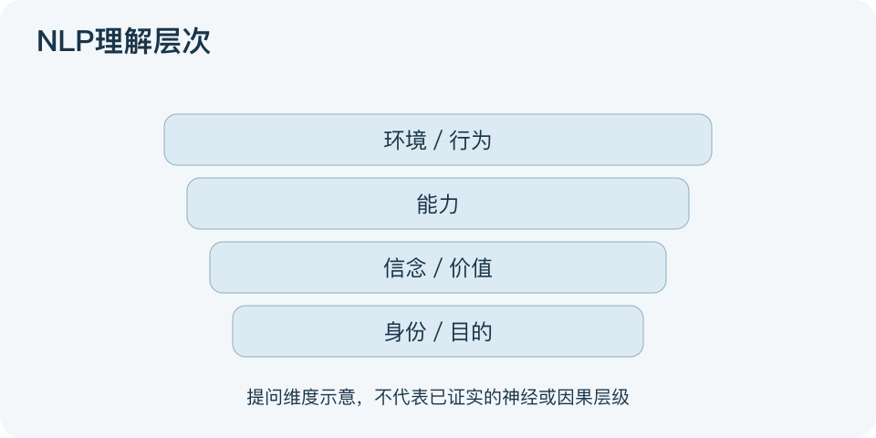

# NLP理解层次：一分钟看懂

> 基于通用知识整理，尚未与视频内容核对。
> 内容类型：通用知识版

“这次没练习”和“我就是没能力的人”说的不是同一回事。NLP理解层次常指Robert Dilts的框架，区分环境、行为、能力、信念价值、身份及更大系统中的目的。这里的NLP是神经语言程序学，不是自然语言处理。

- 环境问何时何地，行为问具体做了什么。
- 能力问怎样做，信念价值问为什么重视或限制它。
- 身份问如何理解角色，目的问服务于谁或什么。
- 这些可以作为提问角度，不能据此把人排成高低等级。

最简应用：把困扰改写为可观察事件，先检查情境、行为和技能，再在自愿前提下讨论价值与角色，最后选一个能验证的小行动。图分组展示提问维度，没有画“高层必定支配低层”的因果箭头。

本文介绍常见版本并保留证据边界。NLP健康干预的系统综述指出支持证据有限，这也不能被偷换成该层次模型已有临床验证。误区是宣称万能、神经机制已获证实，或用“身份有问题”代替实际资源和技能支持。

文字依据和适用边界见[明细](明细.md)。

[模型主页](README.md) · [明细](明细.md) · [案例](案例.md)
