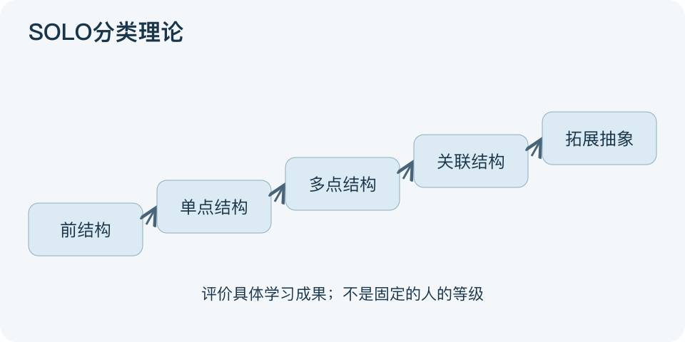

# SOLO分类理论：一分钟看懂

> 基于通用知识整理，尚未与视频内容核对。
> 内容类型：通用知识版

“能列出五个知识点”与“能解释它们怎样连起来”不是同一种理解。SOLO是观察学习成果结构的分类理论，由Biggs与Collis提出；它评价某项任务的回答，不给人贴永久智力等级。

- 前结构：没有抓住题意，回答与问题不相关。
- 单点结构：抓住一个相关方面。
- 多点结构：列出多个相关方面，但彼此孤立。
- 关联结构：能把要点组织为有关系的整体。
- 拓展抽象：从整体提炼原则，迁移到新问题并说明条件。

最简应用：选一题先写答案，检查是“列点”还是“解释关系”，再追加一个陌生情境检验迁移。比如学习水循环，背出蒸发、降水属于列点；说明温度变化如何影响循环，并在新条件下推演，才提供更复杂理解的证据。

层次取决于任务及回答质量，并非字数越多越高。图中的递进表示成果结构变复杂，不代表每次学习都必须走完五级。不要只堆“分析、创造”等动词就判为高层次；答案必须真正完成相应推理。

文字依据和适用边界见[明细](明细.md)。

[模型主页](README.md) · [明细](明细.md) · [案例](案例.md)
