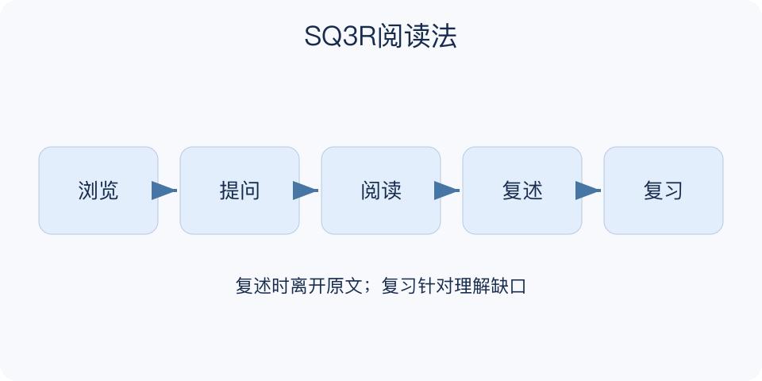

# SQ3R阅读法：一分钟看懂

> 基于通用知识整理，尚未与视频内容核对。
> 内容类型：通用知识版

**版本与边界：** 采用Survey、Question、Read、Recite、Review五步版本；Recite强调脱离原文回忆和解释，不是逐字背诵。

读完一章却讲不出它解决了什么问题，可以试试SQ3R：先浏览结构，再提出问题，带着问题阅读，合上书复述，最后检查并复习。它把阅读从眼睛经过文字，变成主动组织与提取知识。

- 浏览看结构：标题、图表和小结帮助判断重点。
- 提问定方向：把小标题改成需要解释的问题。
- 阅读找论证：既找答案，也看条件、证据与例外。
- 复述查理解：不用原句，说清概念和因果关系。
- 复习补缺口：优先处理答不出的部分，并再次自测。

今天先用一小节练习：写两个问题，读完后遮住书，分别口述答案，再回原文核对遗漏。不要等整本读完才第一次回忆。

把五步做成繁重抄写，会挤掉理解时间；只寻找预设答案又可能漏掉作者真正要说的内容。遇到新问题，应允许修改问题清单。

一份有效产物可以很短：两个问题、两段自己的解释和一个待查疑点。检验时不仅问记不记得，还问能否换个例子说明同一原理，以及知道它在什么条件下不能用。

文字依据见[明细的参考资料](明细.md#文字参考)。

[模型主页](README.md) · [一分钟看懂](一分钟看懂.md) · [明细](明细.md) · [案例](案例.md)
