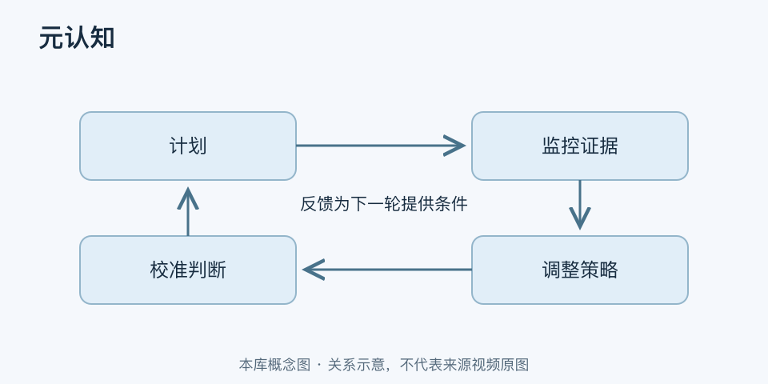

# 元认知｜一分钟看懂

> 基于通用知识整理，尚未与视频内容核对。
> 内容类型：通用知识版

[返回主题](README.md) · [明细](明细.md) · [案例](案例.md)

做题前估计自己已经掌握，交卷后却发现漏洞，元认知关心的正是这种“我怎样认识和管理自己的认知”。它包括对任务、策略与自身能力的了解，也包括计划、监控和调整学习过程。本稿采用学习科学中的一般含义，不把它包装成一种神秘的高阶智力。

- 计划：先判断任务要求与已有知识，选择合适方法。
- 监控：用解释、练习或反馈检查进度，少凭熟悉感。
- 调节：发现方法无效时改变策略、寻求帮助或补基础。
- 校准：比较自评与实际表现，逐步修正自己的判断。

最简做法：开始前写“我预计能完成什么”，结束后用一个独立任务检查，记录自评与结果的差距，再选一处调整。例如读完章节先闭卷列出主张与证据，之后才翻书核对。

反思越多不一定越好。一直想“我是不是不够聪明”却没有新证据，只会占用行动时间。有效元认知需要短反馈循环和可执行调整，也不应把一次低分推广成永久能力标签。
