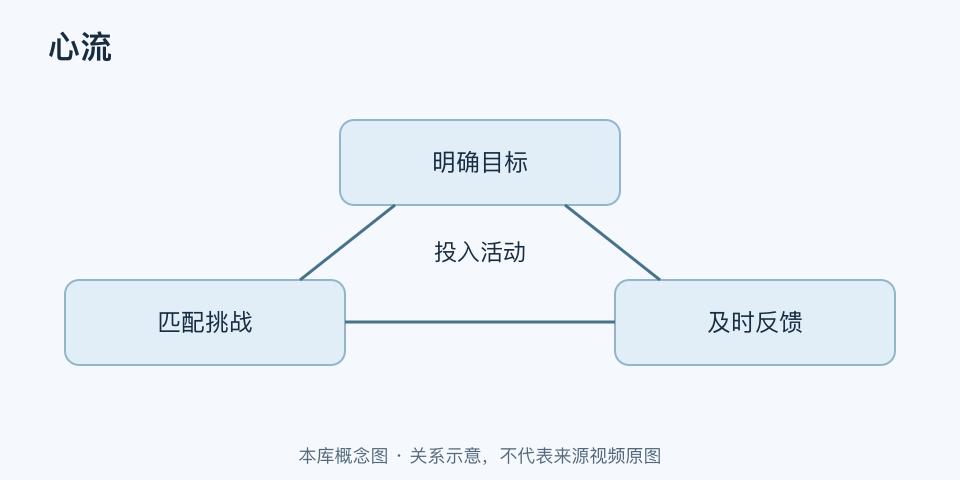

# 心流｜一分钟看懂

> 基于通用知识整理，尚未与视频内容核对。
> 内容类型：通用知识版

[返回主题](README.md) · [明细](明细.md) · [案例](案例.md)

写作、解题或练琴时，你全神贯注于眼前任务，能不断知道下一步该怎么做，时间感也可能改变，这类体验常被称为心流。本稿采用契克森米哈赖研究传统中的心理学含义，不把任何“停不下来”都叫心流。

- 任务目标清楚：知道这段练习要完成什么。
- 反馈可用：能判断动作或答案是否接近目标。
- 挑战与当前技能相配：需要投入，又不至于完全无从下手。
- 注意集中在活动本身，而不是持续评价自己表现得像不像高手。

最简应用：选一项具体任务，设一个可见的小终点，清掉可避免的干扰，完成后检查难度。太轻松就增加变化，卡死就拆小或补基本技能。记录“做了什么”与“体验如何”，不要只追求忘记时间。

这些是有利条件，不是进入心流的保证公式。疲惫、环境中断和任务性质都会影响体验；没有心流也能有效学习。工作安排仍需保留休息、交接与必要沟通。
