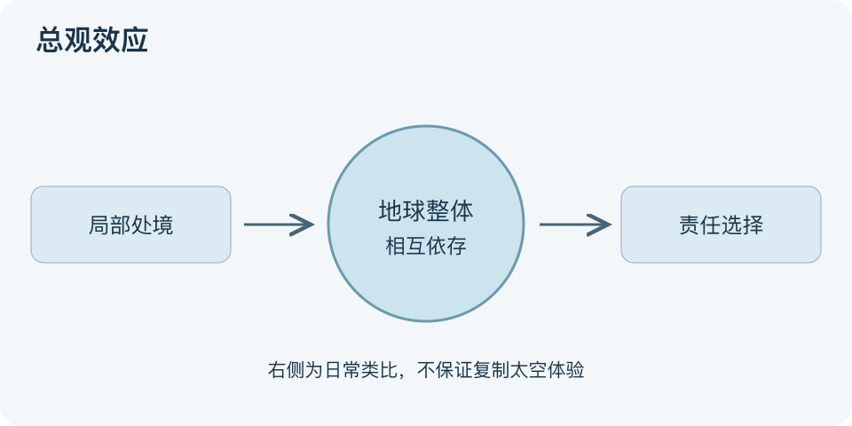

# 总观效应：一分钟看懂

> 基于通用知识整理，尚未与视频内容核对。
> 内容类型：通用知识版

从太空看地球，一些航天员描述自己更强烈地意识到地球的整体性、脆弱性与人类共享的处境。Frank White以“总观效应”命名这类体验；它不是单纯站高一点，也不是人人都会发生的认知升级。

- 起点是特定的观察体验，而非一套必做步骤。
- 常见描述涉及敬畏、边界感变化和共同归属，个体反应不同。
- 体验报告不自动证明长期行为一定改变。
- 日常全局观察可作为类比练习，但不能宣称等同太空体验。

最简日常借鉴：把眼前问题放回更大系统，列出你依赖谁、影响谁、共享什么资源，再回到一项具体可做的行动。图由局部视角扩大到地球整体，再回到责任选择，后半段是本库实践类比，不是效果保证。

误区是认为有宏观视角就不必关心局部权益，或看过一张地球照片就获得正确答案。共同处境不能抹去资源、风险和权力差异；全局意识应帮助更认真地处理这些具体问题。

文字依据和适用边界见[明细](明细.md)。

[模型主页](README.md) · [明细](明细.md) · [案例](案例.md)
