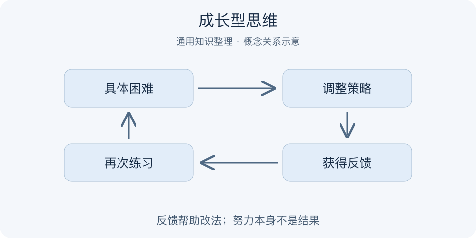

# 成长型思维｜一分钟看懂

> 基于通用知识整理，尚未与视频内容核对。
> 内容类型：通用知识版

采用德韦克关于能力可发展的通用版本，不能据此认定与视频解释相同。

一道题做错，究竟意味着“我没有天赋”，还是“这个知识点和方法还需要调整”？成长型思维把当前表现与永久能力分开：能力能够在练习、有效策略、反馈和支持下发展。它解决的是遇到困难就提前给自己判定上限的问题，不承诺人人都能达到同样水平。

- 把失败当作需要解释的信息，不当作身份标签。
- 关注用了什么策略、哪里有效，而非只表扬努力。
- 主动求助、改变练法，也属于坚持学习。
- 能力可发展，不等于环境限制和个体差异不存在。

最简做法：选一个具体薄弱点，保留当前作品；改变一种练习方式，请别人指出一处可改之处，再用相似任务复测。若没有改善，应调整方法和资源，而非继续堆时间。常见误区是用“你要成长”指责学习者，或把休息和转向都当成失败。

可用一句话检查反馈质量：听完之后，学习者是否知道下一次具体要做哪件不同的事？若只得到鼓励，还缺少行动信息。

---

[来源入口](README.md) · [明细](明细.md) · [案例](案例.md)
