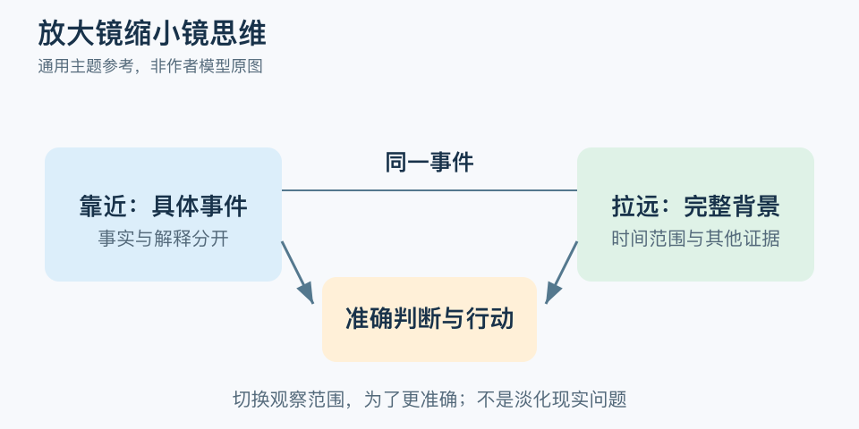

# 放大镜缩小镜思维：一分钟看懂

> 基于通用知识整理，尚未与视频内容核对。
> 内容类型：主题参考版（原义待核实）

> 题名定义待核实；以下为相关主题参考，不代表该模型或作者观点。实际参考主题：证据核对与视角切换。

一次汇报没答好，就推断“我一直都不行”，是把局部事件扩展成整体评价。本稿实际讨论的是证据核对与视角切换：靠近时看清具体问题，拉远时检查范围、时间与其他证据，不把这套练习认定为题名模型的原版步骤。

- 放近：写清发生了什么，分开事实与自己的解释。
- 拉远：把单次事件放回一段时间或完整任务中比较。
- 换角度：考虑其他解释，也看支持和不支持当前判断的证据。
- 回行动：确定眼下能修正的一件事，避免只在脑中反复评价。

最简应用是写下“发生的事—我的判断—遗漏的背景—下一步”。例如“答错一题”可以对应“这部分准备不足”，不必跳到“我没有能力”。

常见误区是把坏事缩小到可以忽略，或强迫自己只看积极面。具体损失需要承认，现实问题仍需处理；改变观察范围是为了判断更准确，不是证明担忧都不存在，更不是心理治疗的替代品。若证据还不足，可以保留未知，先做能够获得信息的小行动。

文字定义与适用边界参见[明细](明细.md)。

[模型主页](README.md) · [明细](明细.md) · [案例](案例.md)
