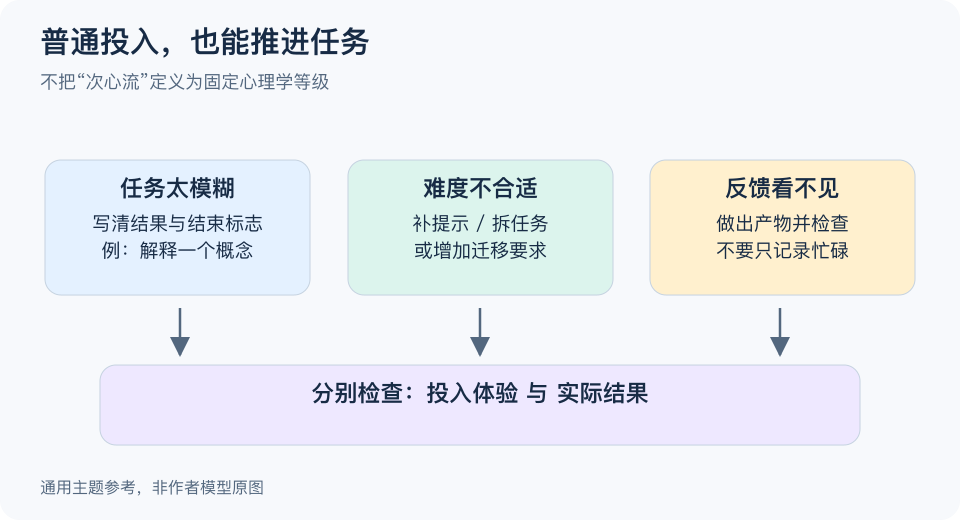

# 次心流：一分钟看懂

> 基于通用知识整理，尚未与视频内容核对。
> 内容类型：主题参考版（原义待核实）
> “次心流”没有在本次资料中获得与视频一致的定义；以下采用“普通投入也能推进任务”的参考主题，不定义新的心理学等级。

没有达到忘我状态，也可以把事情做得很好。这里的参考主题是：先设计一个足够投入、能够检查结果的工作片段，而不是等待理想的心流才开始。它不把“次心流”解释成统一量表上的某一分，也不承诺人人先经过这一阶段。

- **投入有不同表现。** 有人安静专注，有人边做边检查，不能只凭忘记时间判断学习质量。
- **目标先落到动作。** “完成这段摘要并找出一个疑问”比“今天进入心流”更能指导开始。
- **保留可见反馈。** 看得到哪里完成、哪里出错，才有条件调整难度和方法。
- **把难度当作可调项。** 太难可以增加提示或拆分，太易可以增加一个有价值的要求，但不是机械追求刺激。

最简步骤是选一项小任务，定义结束标志，减少一个明显干扰，完成后检查结果和体验。两者不一致时，优先看实际目标：感觉费力但学会了，不一定失败；感觉顺畅但只在重复熟悉内容，也未必进步。

常见误区是给日常状态强行贴上“心流、次心流、失败”的标签。图中的任务调节关系是工作建议，不是脑机制图、诊断标准或经验证的阶段序列。

[模型主页](README.md) · [明细](明细.md) · [案例](案例.md)
