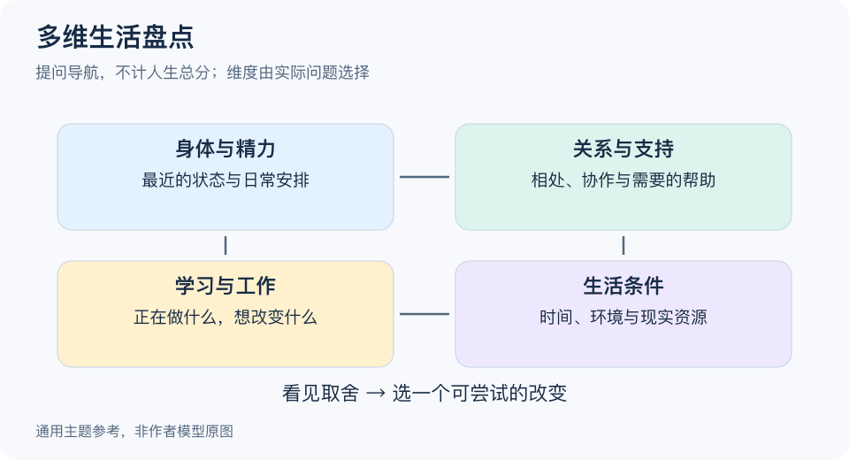

# 生命的维度：一分钟看懂

> 基于通用知识整理，尚未与视频内容核对。
> 内容类型：主题参考版（原义待核实）
> 视频标题未给出维度定义；以下采用多维生活盘点，不代表作者模型，不用于给生命价值评分或临床评估。

工资变高，却失去休息和相处时间；事情做得多，却觉得没有方向。多维生活盘点提醒我们：一个指标无法代替全部生活。先看自己重视什么、有哪些现实约束，再决定当前最值得改善的一小处。

- **让维度显式。** 身体感受、关系、学习工作、生活环境都可以成为观察角度，具体选择由你的问题决定。
- **分开事实与偏好。** 每周加班几次是记录，是否愿意接受这种安排是价值判断，两者都需要说明。
- **不追求全部满分。** 不同阶段可能有不同侧重；维度之间的取舍需要讨论，而不是藏在总分里。
- **行动要小而明确。** 找出一项可改变的安排，同时识别需要资源或他人配合的条件。

最简步骤：选几个与你当前困扰有关的角度，各写一个事实和一个希望改变的地方，再选一个本周能尝试的动作。到期检查它改善了什么、是否损害其他重要部分。

常见误区是画出雷达图后，把面积当成人生价值，或要求别人照自己的尺度生活。本稿的图是提问导航，不是测量量表；健康或关系问题也不应被简化成“你的某一维太低”。

[模型主页](README.md) · [明细](明细.md) · [案例](案例.md)
